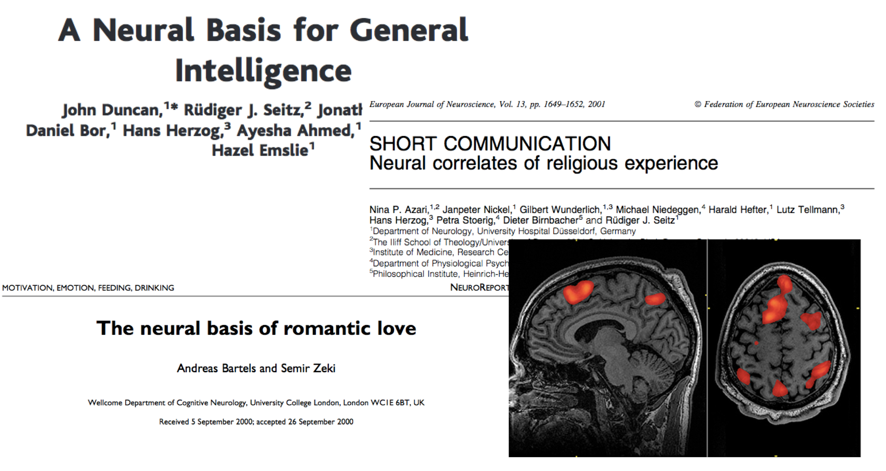
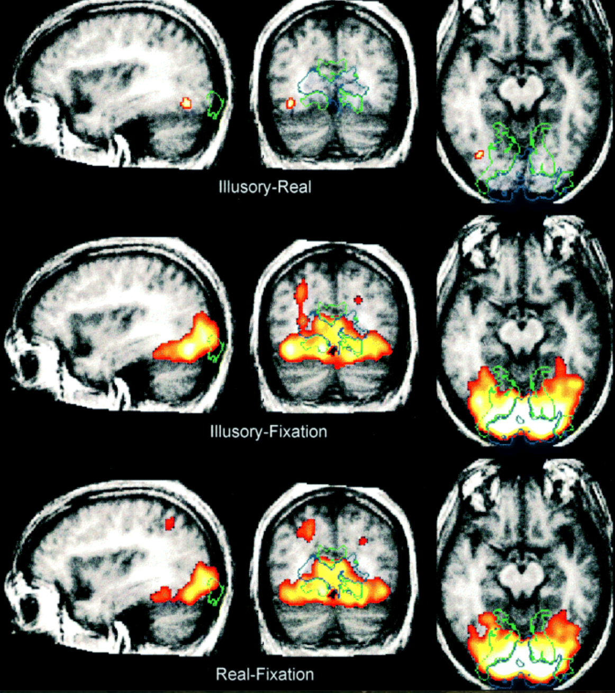
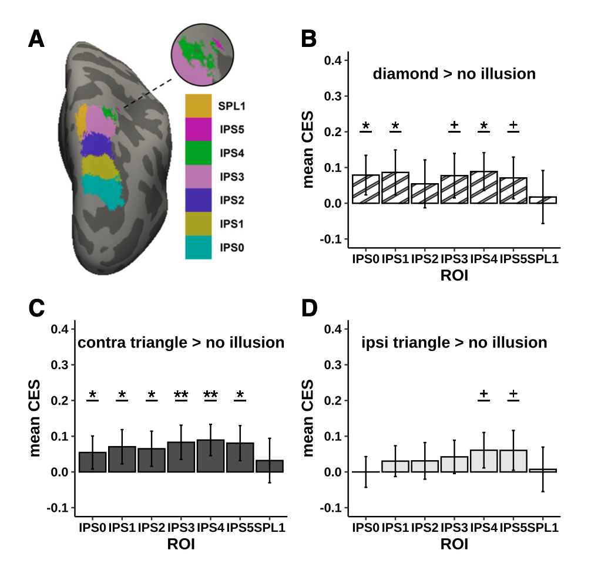
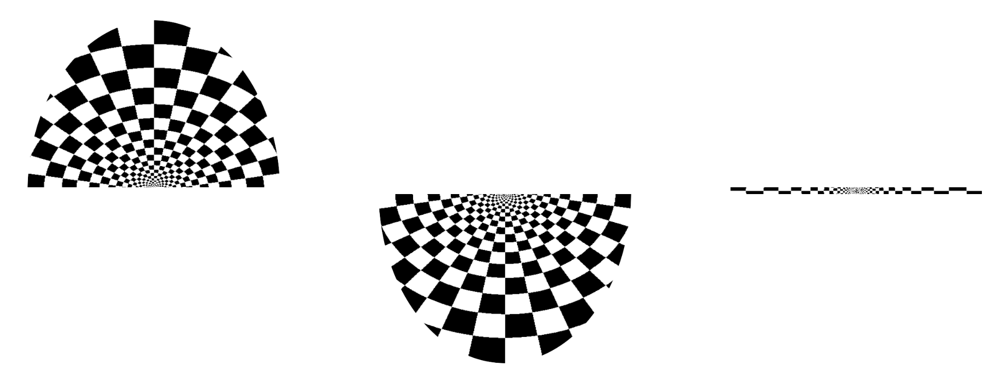
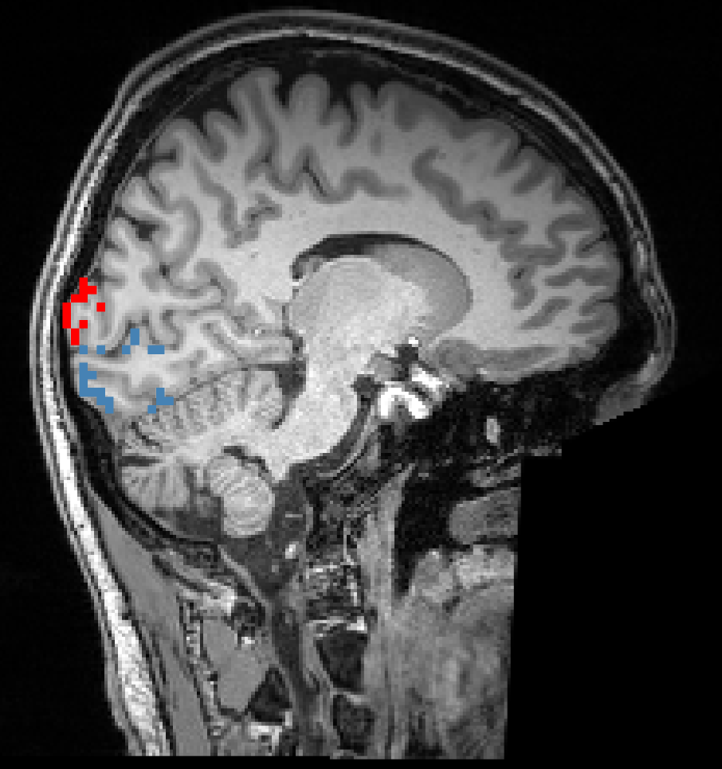
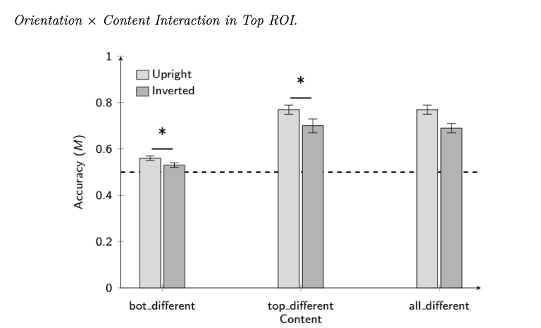
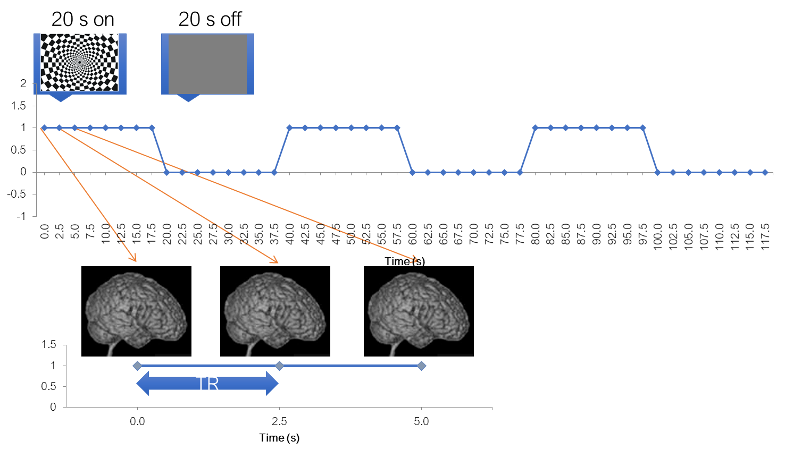

# Planning an fMRI study

![Visual activity in the human claustrum [@coates2024]](images/claus_7TCOR_activity_website.png)

## In this section: experimenter's decisions

-   Whole-brain or ROI analysis (or both)

-   Univariate or multivariate analysis

-   Blocked or event-related design

## Analysis steps



::: notes
No matter what you do, your analysis will boil down to these stages.
:::

## Research questions

## Whole-brain or ROI analysis?

::::: columns
::: {.column width="50%"}
### Exploratory: Neural correlates of illusory shapes

![[@larsson1999]](images/clipboard-3041453640.png)

:::

::: {.column width="50%"}
### Hypothesis-driven: Are illusory shapes represented in the dorsal visual stream?

![[@arsenovic2022]](images/clipboard-1740951478.png)

:::
:::::

## Defining ROIs

-   Functional localizer scan

-   Anatomical scan segmentation

-   Atlas in standard space

## Functional localizer scan

::::: columns
::: {.column width="50%"}

:::

::: {.column width="\"50%"}

:::
:::::

## Cortical atlas

![HCP cortical parcellation ("Glasser atlas") [@glasser2016]](images/clipboard-2858615543.png)

::: notes
ROI analysis is a way to deal with multiple comparison problem. But it requires an a priory and independent definition of an ROI.

There are two ways to define ROIs:

-   From an anatomical scan

-   From an additional (separate) functional experiment
:::

## Subcortical ROIs

![NextBrain parcellation containing 333 anatomical structures [@casamitjana2024]](images/next_brain_coronal.png)

::: notes
This is the state-of-the-art for anatomically-based ROI definition based on deep learning
:::

## Univariate or mutlivariate?

![[@murphy2016]](images/clipboard-2550761765.png)

### Univariate: Does FFA respond to composite face illusion?

![[@foster2021]](images/clipboard-348961460.png)

### Multivariate: Is early visual cortex representation reflects the composite face illusion?

## Design: Blocked or event-related

### Terminology reminder

#### Trial

Continuous presentation of 1 experimental condition, usually 1-20 seconds

#### Run

Block of trials separated by interruption of a scanner acquisition, usually 5-10 minutes

#### Session

Block of runs, separated by subject going out of the scanner and going in again, usually at least one day

## References {.smaller}
