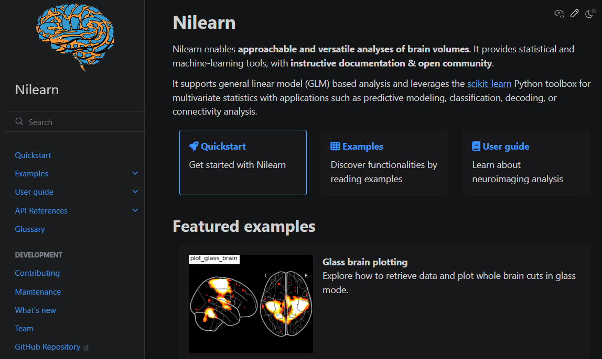
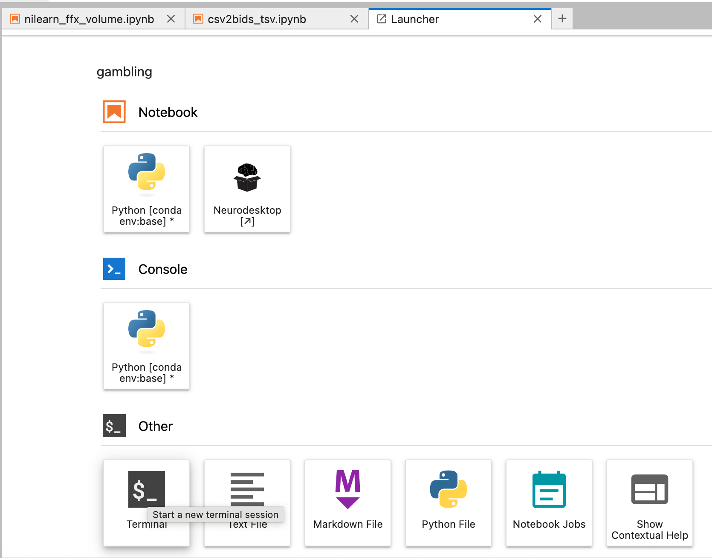

# General linear model analysis

of fMRI data

## Analysis phases



::: {}
For a general overview of basic GLM analysis, see [Introduction to fMRI](fmri-intro.qmd#sec-analysis-steps)
:::

## Before analysis

- Pick your analysis space, dictated by your hypotheses (see also [Preprocessing](preprocessing.qmd#sec-output-spaces))

  - Individual volume (T1w)

  - Template volume (MNI\*)

  - Individual surface (fsnative)

  - Template surface (fsaverage)

- Decide whether/how/how much to smooth the data

## Software



## Nilearn



## Ingredients

- fMRIprep output

- events files in bids format, located in the same directory as the raw functional data

  - compare the psycopy csv files in "data" folder and the tsv bids files in the "bids" folder

  - you can copy them to your folder with the following terminal command or via the file manager

    ``` bash
    # gambling example
    rsync -a -v /shared/2025_SS_SE_ANI/gambling/tsv_behr_data /home/jovyan/gambling/
    ```

  - A zip archive is also attached to the moodle assigment

## Install nilearn

Open the terminal window



type:

``` bash
pip install nilearn
```

and wait until the installation finishes

## Run the analysis

- Open the jupyter notebook nilearn_ffix_volume.ipynb

  - you can copy it with the following terminal command or via the file manager

    ``` bash
    # gambling example
    rsync -a -v /shared/2025_SS_SE_ANI/gambling/nilearn_ffx_volume.ipynb /home/jovyan/gambling/
    ```

  - a copy is also attached to the moodle assignment

- try to run the analysis in the MNI space

Feel free to play around with the parameters and visualization options

## References
