# Multivariate pattern analysis

aka "mind reading"

# General approach {.unnumbered}

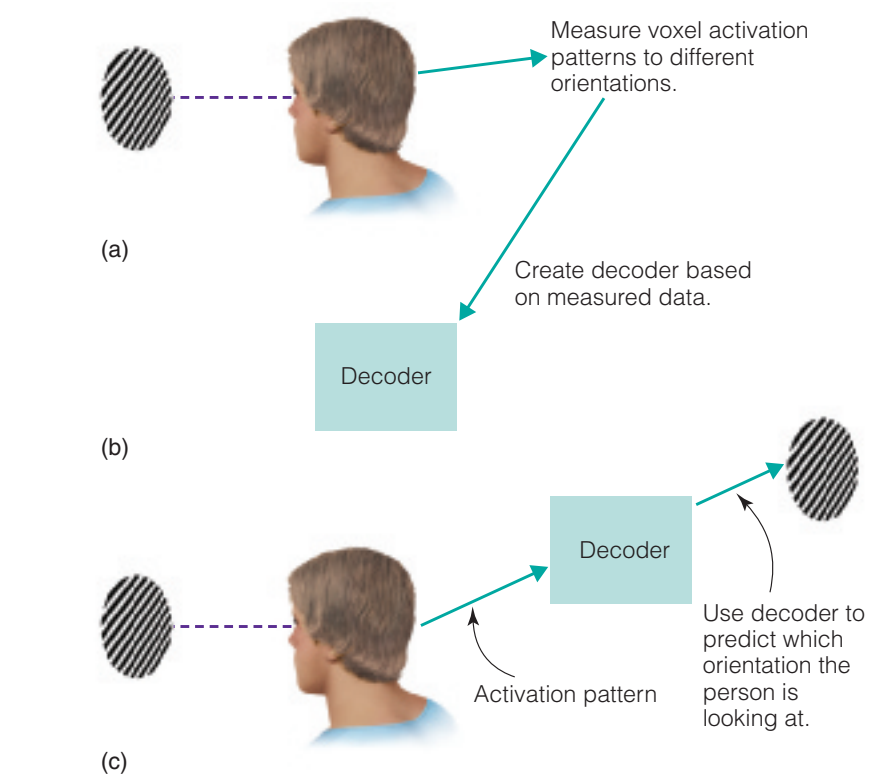

::: notes
DE

Mindreading ist ein Thema, das oft im Zusammenhang mit Objektwahrnehmung besprochen wird, ist aber ein grundsätzliches Thema in der kognitiven Neurowissenschaft. Vielleicht haben Sie schon über Studien gehört, die anhand der neuronalen Aktivität sagen können, was die Person jetzt gerade wahrnimmt. Solche Studien gibt es. Es gibt Limitationen zu dieser Methode und es gibt interessante Aspekte und wir werden jetzt ein Bisschen jetzt darüber sprechen, wie diese Studien funktionieren.

Wie funktioniert Mind Reading? Oftmals braucht man dafür Computeralgorithmen aus dem Bereich des maschinellen Lernens, aber streng genommen ist es nicht notwendig, wenn man nur zwischen zwei Sachen unterscheiden möchte. Wenn wir einfach nur wissen wollen, schaut sich die Versuchsperson jetzt ein Gesicht an oder ein Haus, dann reicht es, wenn wir uns die Aktivität im Gesichtsareal anschauen und gleichzeitig im Ortsareal (wenn wir direkt das nutzen, was wir gerade über das Gehirn gelernt haben), und je nachdem, wo die Aktivität höher ist, können wir daraus schließen, was die Person wahrnimmt. Aber es ist „cooler“, wen man Computeralgorithmen Nutzen kann, und sie können auch ein bisschen mehr als Gesichter und Häuser unterschieden.

Typischerweise läuft ein mind reading Experiment so ab. Man zeigt der Versuchsperson verschiedene Reizkategorien, in diesem Beispiel sind das Gittermuster, die unterschiedlich orientiert sind, und man misst die Aktivität im Gehirn, typischerweise mittels fMRT, aber man kann auch EEG dafür brauchen. Man lässt ein Computeralgorithmus lernen, wie das, was die Person wahrnimmt, mit dem Muster der Gehirnaktivität zusammenhängt. Der Algorithmus lernt das Mapping zwischen Reiz und Gehirnaktivität. Und dieses gelernte Mapping nennt man Decoder. Das alles passiert in der Trainingsphase, wo der Algorithmus trainiert wird.

Dann gibt es aber eine Testphase, wo man der Versuchsperson ein Muster präsentiert, schaut die Aktivität im Gehirn an und vergleicht mit dem, was dieser Decoder gelernt hat. Und das Ähnlichste zu dem, was der Decoder gelernt hat, nimmt man, um eine Entscheidung zu treffen. Zum Beispiel, wenn die aktuelle Aktivität für Decoder so ähnlich aussieht wie der gelernte Muster für rechtsgerichtete Gitter, dann wird Decoder rechtsgerichtete Gitter vorhersagen.
:::

::: notes
EN

Mindreading is a topic that is often discussed in the context of object perception, but it is a fundamental topic in cognitive neuroscience. You may have already heard about studies that can tell, based on neural activity, what a person is currently perceiving. Such studies exist. There are limitations to this method, and there are interesting aspects to it, and we will now talk a little about how these studies work.

How does mind reading work? It often requires computer algorithms from the field of machine learning, but strictly speaking this is not necessary if you only want to distinguish between two things. If we simply want to know whether a participant is currently looking at a face or a house, it is sufficient to look at the activity in the face area and at the same time in the place area (if we directly use what we have just learned about the brain), and depending on where the activity is higher, we can infer what the person is perceiving. But it is "cooler" when you can use computer algorithms, and they can do a little more than just distinguish between faces and houses.

Typically, a mind reading experiment works as follows. Participants are shown different stimulus categories — in this example, gratings oriented in different directions — and brain activity is measured, typically using fMRI, although EEG can also be used. A computer algorithm is then trained to learn how what the person perceives relates to the pattern of brain activity. The algorithm learns the mapping between stimulus and brain activity, and this learned mapping is called a decoder. All of this happens in the training phase, where the algorithm is trained.

There is then a test phase, where a pattern is presented to the participant, the brain activity is observed, and compared with what the decoder has learned. The closest match to what the decoder has learned is then used to make a decision. For example, if the current brain activity looks similar to the decoder's learned pattern for rightward-oriented gratings, the decoder will predict rightward-oriented gratings.
:::

## Univariate fMRI analysis

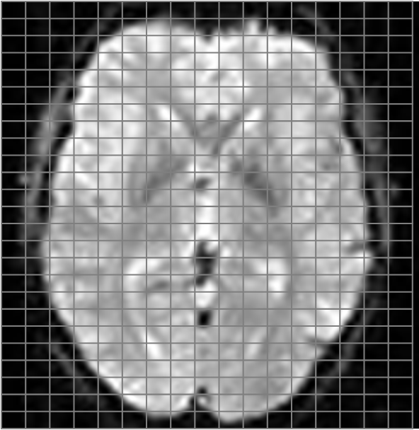

::: notes
Univariate analysis is what we typically do in research. Examples include:

- Assessing differences in reaction times or error rates

- Comparing the amplitudes of event-related potentials or the power of oscillations at a specific frequency

- Analyzing brain activity at a specific brain location

Although we may have multiple dependent variables (many voxels, electrodes or time pints), we perform an analysis for each variable independently and separately from other variables.

In a multivariate analysis we consider multiple dependent variables *together*.
:::

## The checkerboard experiment


## Multivariate pattern analysis

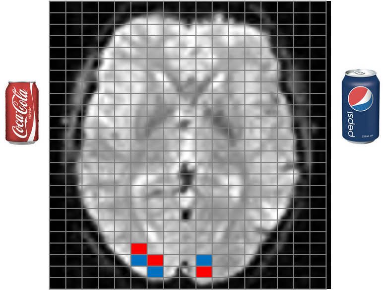

::: notes
Remember that an image is 4d and consists of little 3d cubes called voxels, with the 4th dimension being time. A classical analysis is done over time for every voxel in the brain independently. In a multivariate analysis we first perform a univariate analysis and then look at response patterns of multiple voxels at a time.

In this example, both coca cola and pepsi activate the same 6 voxels in the visual cortex. But the red ones are activated more by cola then by pepsi, and the blue ones the other way around. If you just look at the average response over 6 voxels, you will not see a difference.
:::

## Cola vs. Pepsi

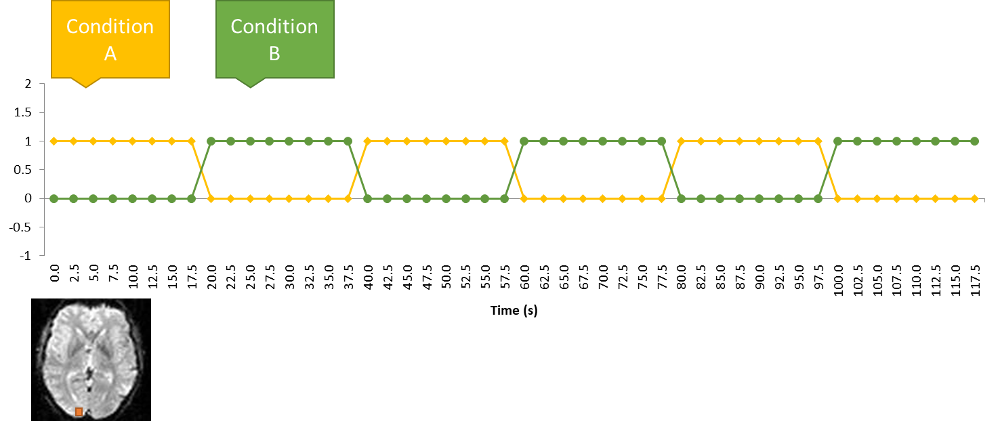

## Whole-brain: searchlight analysis

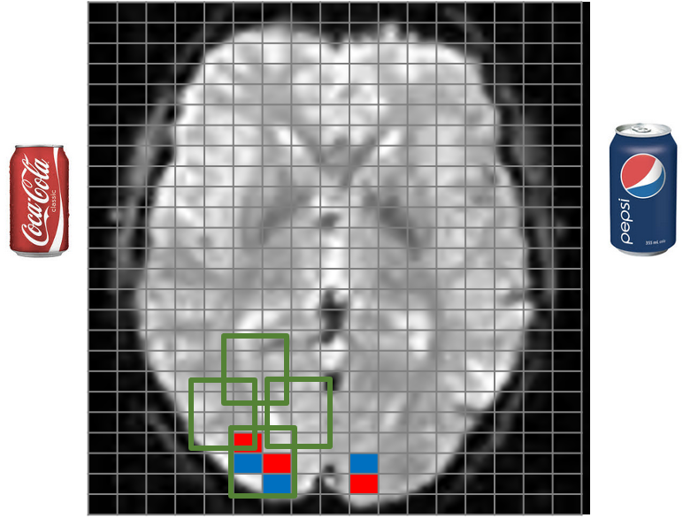

::: notes
MVPA can be done for a region of interest, or for the entire brain. In the latter case, the brain is subdivided into multiple ROIs, and the relevant analysis is performed for each of them. This procedure is called "searchlight". In this case, MCC is as relevant as it is in a univariate analysis.
:::

## First MVPA paper

![Representation similarity analysis [@haxby2001]](images/clipboard-3545400342.png)

## First MVPA paper

![Representation similarity analysis [@haxby2001]](images/clipboard-1666315153.png)

## Main principle

### Two runs, 3 voxels

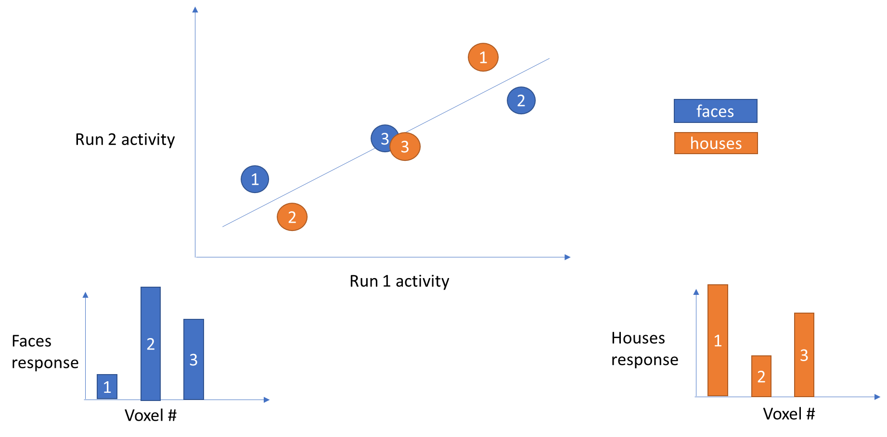

## Machine learning: SVM classifier

::::: columns
::: {.column width="50%"}
![Toy example for 2D feature space, image credit [@cohen2017]](images/clipboard-501282590.png){width="600"}
:::

::: {.column .fragment width="50%"}
```{r}
#| warning: false
#| fig-width: 8
#| fig-height: 5

library(ggplot2)
library(patchwork)

# Shared y-axis limits
ylims <- c(-2.5, 2.5)

# --- Scenes plot ---
scenes_data <- data.frame(
  Voxel      = c("Voxel 1", "Voxel 2"),
  Activation = c(2, -1)
)

p_scenes <- ggplot(scenes_data, aes(x = Voxel, y = Activation, fill = Voxel)) +
  geom_col(width = 0.5, color = "white", linewidth = 0.4) +
  geom_hline(yintercept = 0, color = "grey30", linewidth = 0.5) +
  geom_text(
    aes(
      label = ifelse(Activation >= 0, paste0("+", Activation), Activation),
      vjust = ifelse(Activation >= 0, -0.5, 1.3)
    ),
    size = 4.5, fontface = "bold"
  ) +
  scale_fill_manual(values = c("Voxel 1" = "#2166ac", "Voxel 2" = "#6baed6")) +
  scale_y_continuous(limits = ylims, breaks = seq(-2, 2, 1)) +
  labs(title = "Scenes", x = NULL, y = "Activation") +
  theme_minimal(base_size = 13) +
  theme(
    plot.title      = element_text(face = "bold", size = 14, hjust = 0.5),
    legend.position = "none",
    panel.grid.major.x = element_blank(),
    panel.grid.minor   = element_blank()
  )

# --- Faces plot ---
faces_data <- data.frame(
  Voxel      = c("Voxel 1", "Voxel 2"),
  Activation = c(-2, 1)
)

p_faces <- ggplot(faces_data, aes(x = Voxel, y = Activation, fill = Voxel)) +
  geom_col(width = 0.5, color = "white", linewidth = 0.4) +
  geom_hline(yintercept = 0, color = "grey30", linewidth = 0.5) +
  geom_text(
    aes(
      label = ifelse(Activation >= 0, paste0("+", Activation), Activation),
      vjust = ifelse(Activation >= 0, -0.5, 1.3)
    ),
    size = 4.5, fontface = "bold"
  ) +
  scale_fill_manual(values = c("Voxel 1" = "#d6604d", "Voxel 2" = "#f4a582")) +
  scale_y_continuous(limits = ylims, breaks = seq(-2, 2, 1)) +
  labs(title = "Faces", x = NULL, y = "Activation") +
  theme_minimal(base_size = 13) +
  theme(
    plot.title      = element_text(face = "bold", size = 14, hjust = 0.5),
    legend.position = "none",
    panel.grid.major.x = element_blank(),
    panel.grid.minor   = element_blank()
  )

# Combine side by side
p_scenes + p_faces +
  plot_annotation(
    title    = "Voxel Activation Patterns by Stimulus Category",
#    subtitle = "Scenes and Faces produce opposite (opponent) activation patterns",
    theme = theme(
      plot.title    = element_text(face = "bold", size = 15),
      plot.subtitle = element_text(color = "grey40", size = 11)
    )
  )
```
:::
:::::

::: notes
In this example voxel 1 responds slightly more to scenes than faces, and voxel 2 responds slightly more to faces than scenes. The scenes evoke a pattern: voxel1=2, voxel2=-1; and faces evoke a pattern: voxel=-2, voxel2=1

The difference in average activity (over both voxels) is actually not so big, it is -0.5 for faces and 0.5 for scenes. In principle you can find a scenario where there is no mean difference at all. But the *patterns* are different.

More recommended reading: [@peelen2023]
:::

## Machine learning

First MVPA papers, both appeared in 2005 [@haynes2005; @kamitani2005]

::::::: columns
::::: {.column width="50%"}
::: {.content-visible when-format="revealjs"}
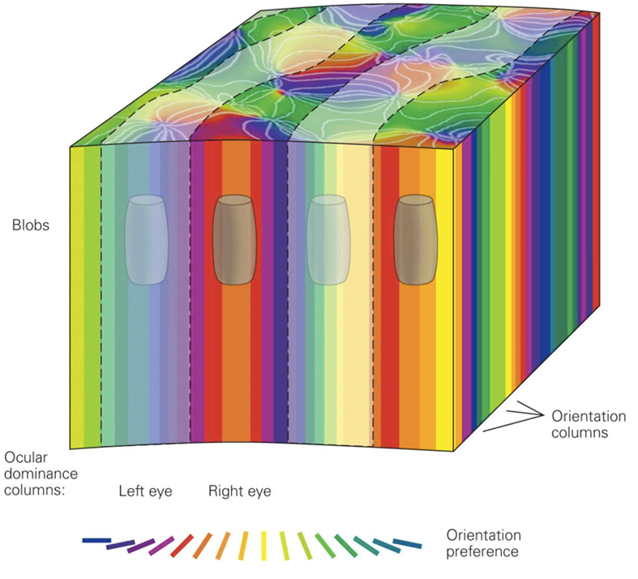
:::

::: {.content-visible unless-format="revealjs"}
This image can not be displayed due to copyright reason. Please refer to (c) Kandel, 6th edition, Figure 21-13
:::
:::::

::: {.column width="50%"}
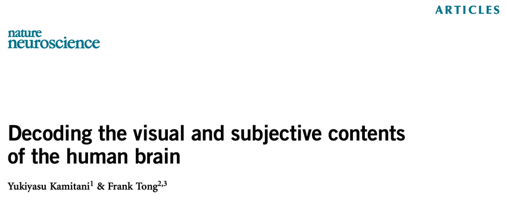 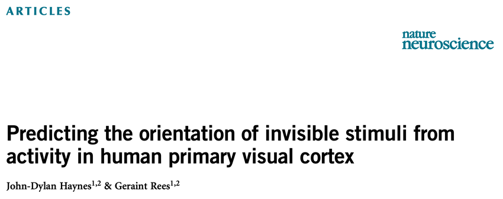
:::
:::::::

::: notes
DE

Sie werden mich jetzt fragen: wie geht das? Die Auflösung von FMRI ist doch, aber sie ist nicht auf der Ebene einzelner Neuronen. Rechts ist ungefähr zum Vergleich der Volumen von einem fMRI-Voxel: Hier sind Orientierungskolumnen mit mehreren Orientierungen enthalten. Hier nutzt man die Tatsache, dass in jedem Voxel verschiedene Orientierungen vorhanden sind, aber nicht gleichmäßig verteilt. In einem Voxel wird ein Bisschen von einer Orientierung vorhanden sein, und im nächsten Voxel ein bisschen mehr von einer anderen Orientierung. Und diese kleinen Unterschiede können wir mit den Ansätzen des maschinellen Lernens aus den Voxels extrahieren. Im Bild links sind die Unterschiede zwischen den Voxels übertrieben dargestellt. Die Unterschiede in Wirklichkeit sind viel, viel kleiner. Aber gleichzeitig gibt es viel, viel mehr Voxels. Je mehr Voxels wir nehmen, desto besser funktionieren diese Algorithmen.
:::

::: notes
EN

You may ask: how does that work? The resolution of fMRI is — well, it is not at the level of individual neurons. On the left, for comparison, is roughly the volume of one fMRI voxel: it contains orientation columns with multiple orientations. Here we exploit the fact that within each voxel, various orientations are present, but not evenly distributed. A voxel will contain a little bit of one orientation, and the next voxel a little bit more of another orientation. And these small differences can be extracted from the voxels using machine learning approaches. In the image on the left, the differences between voxels are shown in an exaggerated way. The differences in reality are much, much smaller. But at the same time there are many, many more voxels. The more voxels we take, the better these algorithms work.
:::

## Orientation decoding

![From [@kamitani2005]](images/clipboard-2864672151.png)

::: notes
DE

Dieser Ansatz wurde zuerst bei Kamitani und Tong in 2005 verwendet. In fMRI nennt man solche Analyze Multi-Voxel-Pattern-Analysis (MVPA), weil man viele Voxels (das sind so volumetrische Pixels im Gehirn) zusammen gleichzeitig betrachtet. Man hat so einen Algorithmus darauf trainiert, welche Orientierung der Gitter welchem Muster der Voxel-Aktivitäten entspricht. Man konnte dann erfolgreich vorhersagen, welche Orientierung die Person jetzt gerade anschaut.
:::

::: notes
EN

This approach was first used by Kamitani and Tong in 2005. In fMRI, this type of analysis is called Multi-Voxel Pattern Analysis (MVPA), because it involves examining many voxels (which are essentially volumetric pixels in the brain) together at the same time. An algorithm was trained to determine which grid orientation corresponds to which pattern of voxel activity. It was then possible to successfully predict which orientation the person was currently looking at.
:::

## Image decoding

![[@naselaris2009]](images/clipboard-3997079500.png)

::: notes
DE Kamitani und Tong war der erste Versuch, die Wahrnehmung mittels machine learning vorherzusagen. Allerdings sind Gittermuster nicht so spannend. Darum ist man weitergegangen und in dieser Studie von Nasselaris et al., hat man schon versucht, natürliche Bilder aus einem großen Datenbank zu rekonstruieren, die die Menschen gerade betrachtet haben.

Der Decoder in diesem Fall war viel komplexer. Man hat nicht nur ein Mapping zwischen Orientierung und Gehirnaktivität dem Decoder beigebracht, sondern verschiedene Aspekte des Bildes - Kontrast, lokale Information über die Orientierung der Kanten im Bild, und auch semantische Information (zu jedem Bild gab es eine Kategorie - eine Pflanze, ein Tier, eine Szene). Und wenn man das alles kombiniert, dann kann man das gesehene sehr gut rekonstruieren.

Hier sind ein paar Beispiele. In der oberen Reihe links ist das Bild, das man gesehen hat. In der Mitte ist das ähnlichste Bild anhand von lokalen Informationen im Bild, ohne Semantik. Die zwei Bilder sind physikalisch ähnlich, aber nicht inhaltlich ( in beiden ist etwas im Vordergrund und Gebäude im Hintergrund. Wenn man aber semantische Informationen auch berücksichtigt, dann kann man schon sehr ähnliche Bilder im Datenbank finden, die dem Target-Bild entsprechen.

Ähnlich ist es mit der unteren Reihe. Obwohl es nicht perfekt ist (Weintrauben vs. Champignon), aber trotzdem schon ziemlich erstaunlich.

Danach ist man weitergegangen und hat versucht, Inhalte der mentalen Vorstellungen (mental Imagery) und Inhalte der Träume zu rekonstruieren.
:::

::: notes
EN Kamitani and Tong was the first attempt to predict perception using machine learning. However, grid patterns are not so exciting. So they went further, and in this study by Naselaris et al., they already tried to reconstruct natural images from a large database that people were currently looking at.

The decoder in this case was much more complex. They not only taught the decoder a mapping between orientation and brain activity, but also various aspects of the image - contrast, local information about the orientation of edges in the image, and also semantic information (each image had a category - a plant, an animal, a scene). And when you combine all that, you can try to find an image in the database that is most similar in terms of features to what the subject is viewing.

Here are a few examples. In the top row, left is the image that was seen. In the middle is the most similar image based on local information in the image, without semantics. The two images are physically similar, but not semantically (in both there is something in the foreground and buildings in the background). But if you also consider semantic information, then you can already find very similar images in the database that correspond to the target image.

Similarly with the bottom row. Although it's not perfect (grapes vs. mushroom), it's still pretty amazing.
:::

## Video decoding

::: {layout-nrow="2"}
![[@nishimoto2011]](images/clipboard-3952218288.png)

![[@nishimoto2011]](images/clipboard-3682224631.png)
:::

::: notes
Interestingly, the newest (11th) edition of Sensation and Perception already presents a video example, while the previous edition (10th) the static image example
:::

## A recent example

::::: columns
::: {.column width="45%"}
![Image credit: [@cheng2023]](images/clipboard-2185416377.png)
:::

::: {.column .fragment width="55%"}
![Image credit: [@cheng2023]](images/clipboard-3670121725.png)
:::
:::::

::: notes
DE In den Beispielen, die wir gerade besprochen haben, lernt kaum was darüber, wie das Gehirn funktioniert. Man nutzt eher die Kenntnisse über das Gehirn, um Wahrnehmungsinhalte zu dekodieren. Diese allerneueste Studie, die natürlich schon Deep Neural Networks verwendet, ist etwas spannender, weil man daraus etwas lernt.

Hier hat man auch anstatt ein Mapping zwischen dem Bild und Gehirnaktivität, ein Mapping zwischen den Features im Bild und der Gehirnaktivität dem Decoder beigebracht. Aber diese Features (Features sind Eigenschaften des Bildes) waren nicht einfach nur Kanten oder Kontrast. Diese Features wurden von einem Deep Neural Network extrahiert. Diese Deep Neural Networks können sehr komplexe Aspekte des Bildes extrahieren.

Wenn man das macht und dem Decoder ein Mapping zwischen Features und Gehirnaktivität beibringt, kann man nun nicht nur natürliche Bilder, sondern visuelle Täuschungen zeigen. Mann nimmt dann Gehirnaktivität während der Wahrnehmung der visuellen Täuschungen, schaut, welchen Features im Decoder dieser Gehirnaktivität entspricht und nutzt ein zweites neuronales Netzwerk, das Bilder generieren kann, um die Wahrnehmung zu rekonstruieren.

Für diese visuelle Täuschung, wo wir eine Kante in der Mitte wahrnehmen, obwohl die Linien horizontal verlaufen, die eigentlichen Features im Bild sind die horizontale Linien, unsere Wahrnehmung ist aber beides, die vertikale Linie und die horizontalen Linien.
:::

::: notes
EN In the examples we just discussed, we hardly learn anything about how the brain works. Rather, we use knowledge about the brain to decode perceptual content. This very latest study, which of course already uses deep neural networks, is a bit more exciting because we learn something from it.

Here, instead of teaching a mapping between the image and brain activity, they taught a mapping between features in the image and brain activity to the decoder. But these features (features are properties of the image) were not just edges or contrast. These features were extracted by a deep neural network. These deep neural networks can extract very complex aspects of the image.

When you do that and teach the decoder a mapping between features and brain activity, you can now not only show natural images, but also visual illusions. You then take brain activity during the perception of visual illusions, see which features in the decoder correspond to this brain activity, and use a second neural network that can generate images to reconstruct the perception.

For this visual illusion, where we perceive an edge in the middle even though the lines are horizontal, the actual features in the image are the horizontal lines, but our perception is both, the vertical line and the horizontal lines.
:::

## Perceptography

:::::: columns
::: {.column width="10%"}
### Physical stimulus

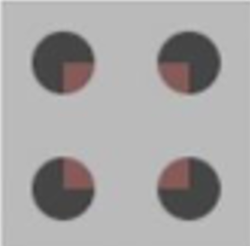
:::

::: {.column width="10%"}
### Stimulus features

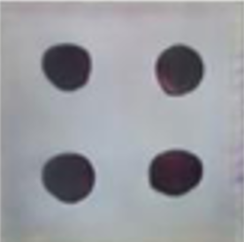
:::

::: {.column .fragment width="80%"}
### Brain-decoded features

![Modified from [@cheng2023]](images/clipboard-3943152936.png)
:::
::::::

## References {.smaller}
