# Experimental paradigm

for fMRI

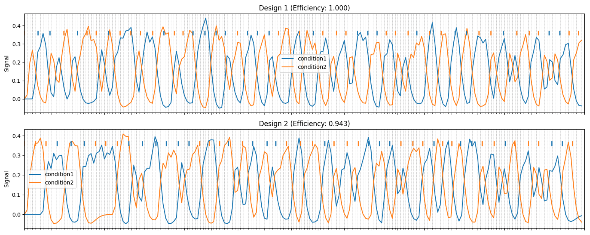

## In this section

-   Technical aspects of an fMRI experiment

-   Software

-   Implementation details

## Software

::::: columns
::: {.column width="50%"}
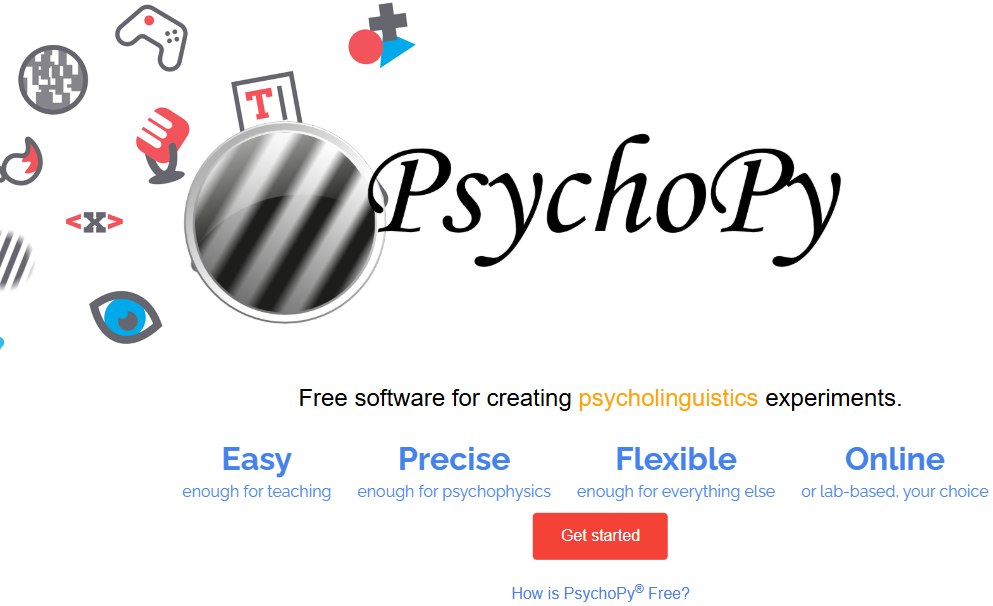
:::

::: {.column width="50%"}

:::
:::::

| Feature                                  | PsychoPy | Psychtoolbox          |
|---------------------------------|-------------------|--------------------|
| GUI                                      | limited  | no                    |
| Mac/Windows                              | yes      | if payed              |
| Linux                                    | (no)     | yes                   |
| Degree of hardware control and precision | less     | more                  |
| Advanced functionality                   | no       | yes                   |
| Timing accuracy                          | less     | more                  |
| Version compativility                    | no       | yes                   |
| Standalone                               | yes      | no (MATLAB or Octave) |

## Runs

-   chunks of 5-10 minute length

-   ideally containing all experimental conditions (there are exceptions)

-   one run - one start of the experimental script

-   one paradigm run corresponds to one fMRI time series file

-   Typically repeated multiple times to fill about 1 hour of scanning

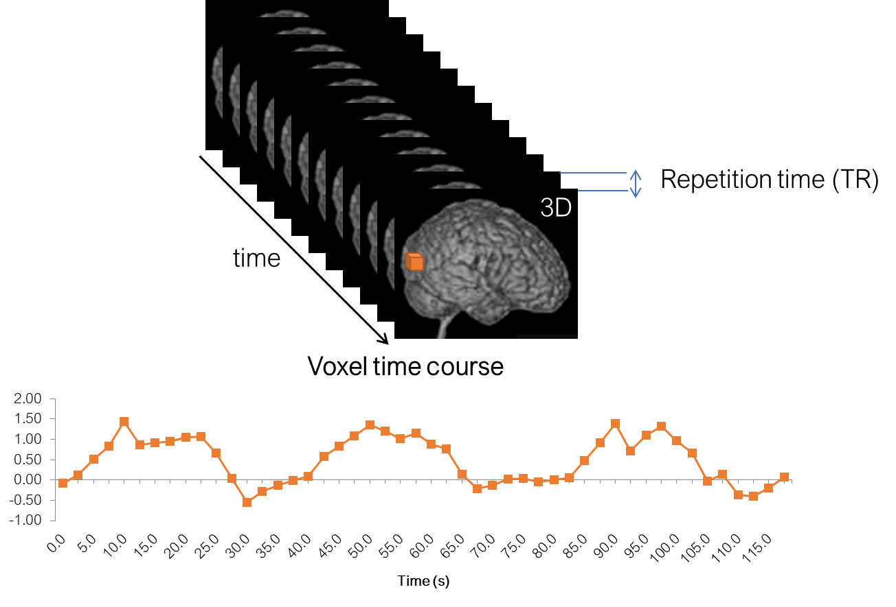

## Start screen

-   The script should start by showing a welcome message or instruction reminder

-   It should be waiting for key "5" (scanner "trigger")

-   This is needed to synchronize the fMRI signal acquisition with your paradigm

## T1 equilibration wait time

-   After the start screen, there should be a period of 5 - 10 seconds of nothing happening; this is needed to discard initial scanner artifacts


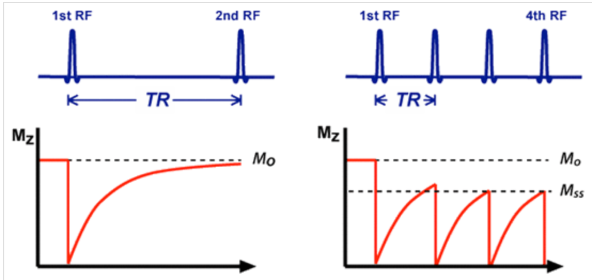

::: notes
This is more of a historical practice that remains from old times.

Back in the day, people even waited a certain amount of volumes before starting the paradigm. This led to misalignment of fMRI and paradigm timings, and to analysis errors.

Modern Siemens scanners discard initial volumes automatically without saving them, so you don't need to care about it. Furthermore, preprocessing software runs additional tests to detect nonsteady state volumes. These volumes (if detected), can be added as niussance regressors to the analysis.
:::

## Behind the scenes

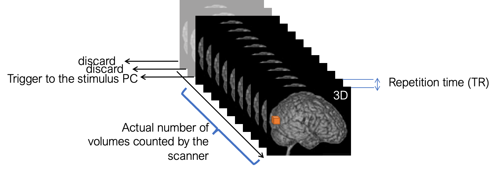

## Video presentation

::::: columns
::: {.column width="50%"}
### Monitor

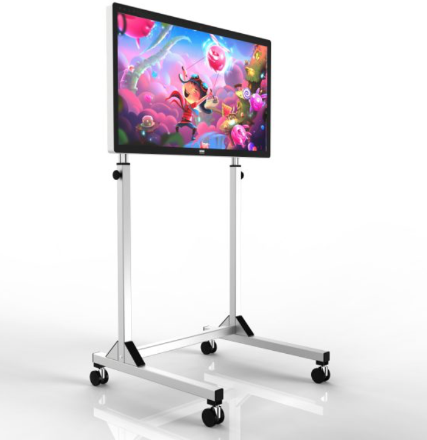
:::

::: {.column width="50%"}
### (VR) Goggles

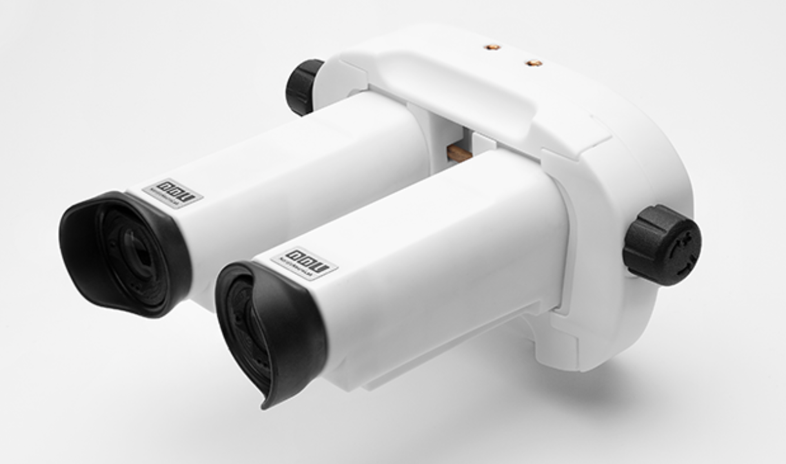
:::
:::::

## Audio

Problem: continuous scanner noise

Solution: High-quality auditory presentation or acquisition interruption

### Ear phones

### Head phones

## Subject responses

### Subject keys

1, 2, 3, 4, \[\], 6, 7, 8, 9

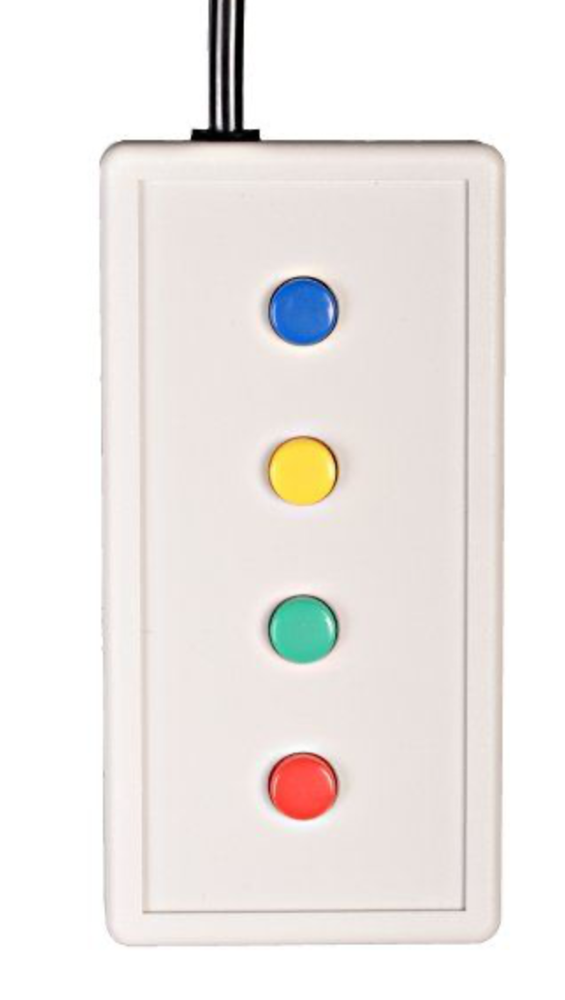{width="50%"}

### Joystick

## Vigilance check

<video autoplay loop muted playsinline style="max-width:100%;">

<source src="images/paradigm_example_betti.mp4" type="video/mp4">

</video>

::: {.content-visible when-format="pdf"}
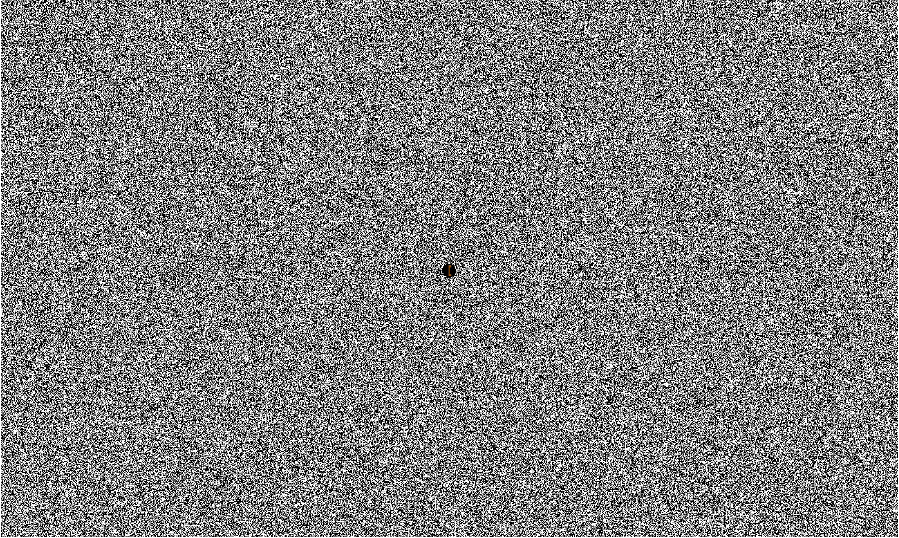{width="80%"}
:::

::: notes
-   If the subject does not have a task, it is important to make sure they are still paying attention to the paradigm and not falling asleep.
-   This can be done by introducing a fixation task
-   For example, the fixation point can change color or shape, and the subject has to press a button when they notice it.
-   In any case, it is useful to give subjects feedback on their performance!
:::

## Paradigm events

::: notes
Throughout the experimental run, we save all important information that happened, such as: - Which condition was presented at which time - Which button was pressed at which time

It is generally encouraged to save as much information as possible, as it can be useful for later analysis and troubleshooting. This is especially important for complex paradigms with many conditions and/or response options. Better save to much than too little!
:::

## Carryover effects

::::: columns
::: {.column width="30%"}


{.fragment}
:::

::: {.column .fragment width="70%"}
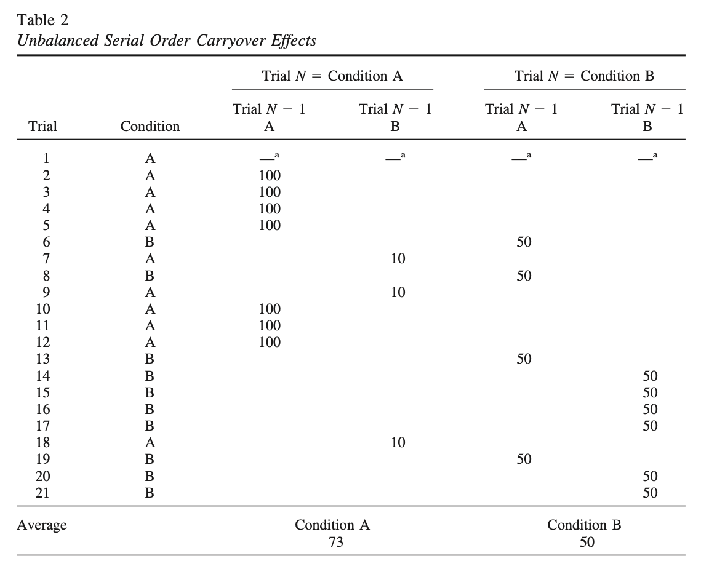
:::
:::::

[@brooks2012a]; code available at <https://supp.apa.org/psycarticles/supplemental/a0029310/MET-Brooks20100184-R-S1.pdf>

## Event-related design efficiency

-   Minimize predictability

-   Avoid order effects

-   Enhance effect size of interest

Relevant papers: [@wager2003; @dale1999; @buracas2002]

## Software

:::::: columns
::: {.column .fragment width="33%"}
Optseq2

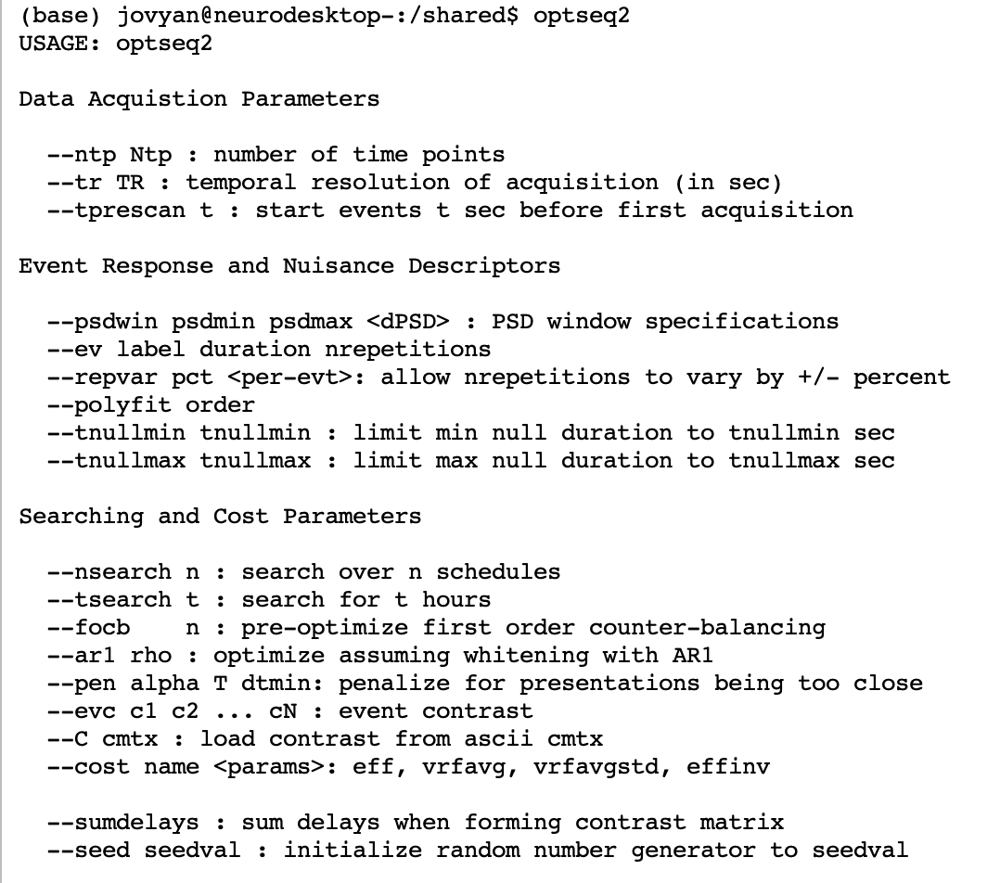
:::

::: {.column .fragment width="33%"}
Optimize-x

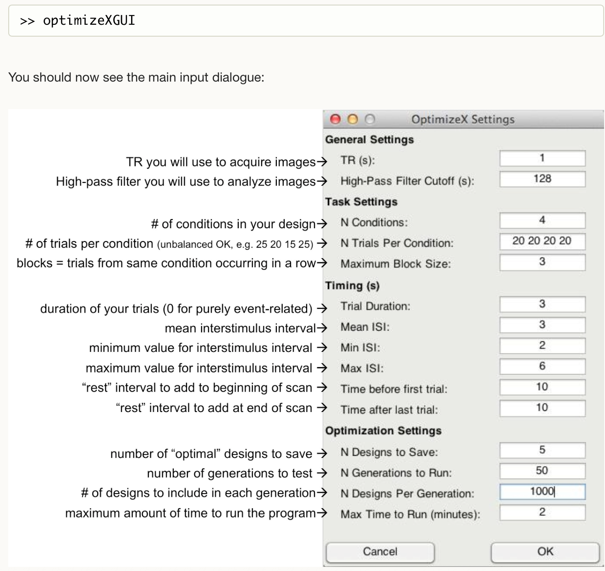
:::

::: {.column .fragment width="33%"}
Neuropower/neurodesign 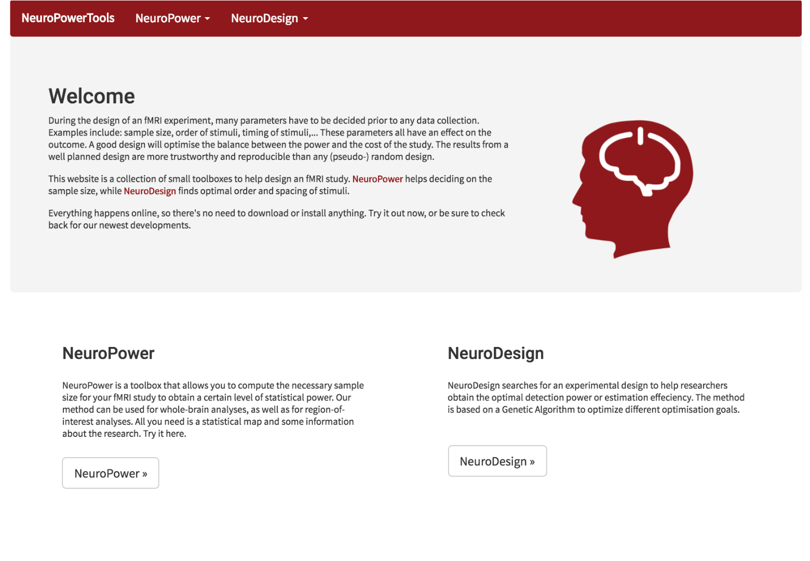
:::
::::::

## Neurodesign advantages

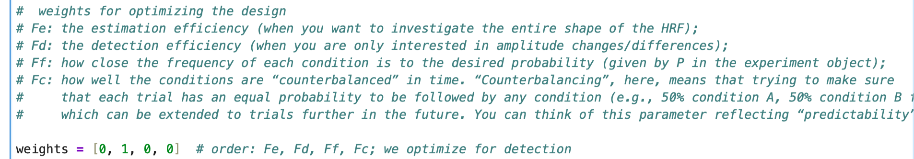

-   Python code

-   Optimization of multiple aspects simultaneously

-   Less requirements on experiment timings

## On neurodesk

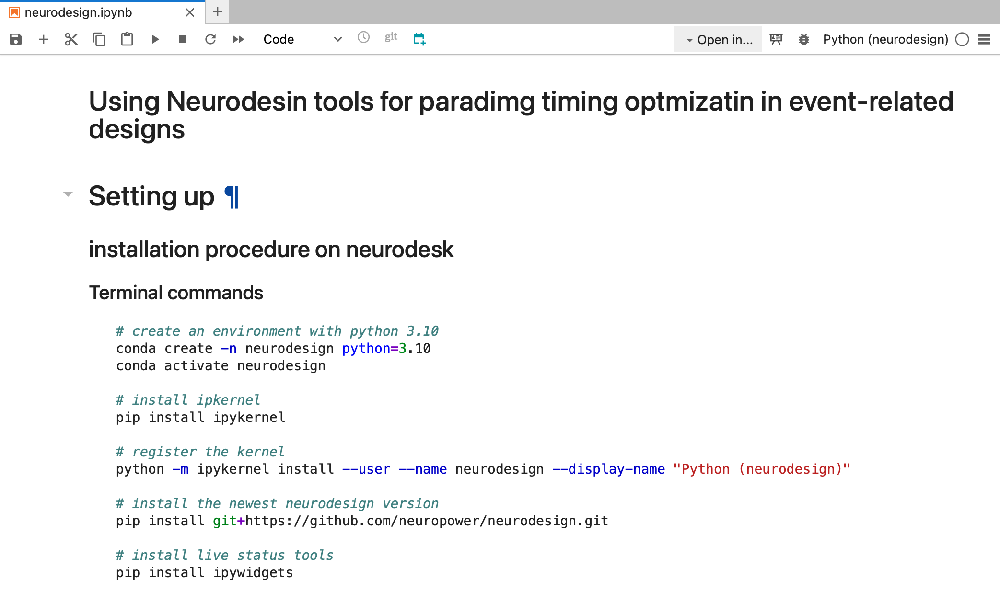

# Practical implementation

## Add run number to the menu

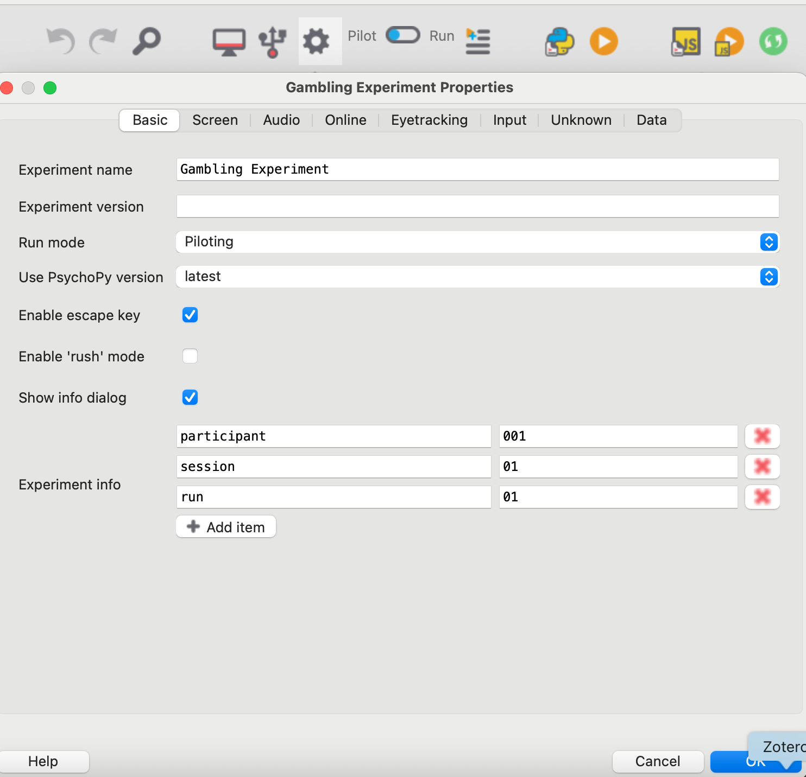

::: notes
This is done in the experiment settings menu
:::

## Generate condition files

-   There should be one file per subject and per run

-   Use BIDS-Style naming convention, e.g.

    -   sub-01_ses-01_task-gambling_run-01_conditions.csv

    -   sub-01_ses-01_task-gambling_run-02_conditions.csv

    -   sub-01_ses-01_task-gambling_run-03_conditions.csv

    -   sub-01_ses-01_task-gambling_run-04_conditions.csv

    -   sub-01_ses-01_task-gambling_run-05_conditions.csv

    -   sub-01_ses-01_task-gambling_run-06_conditions.csv

::: notes
The files should contain your trial loop information based on your paradigm schedule based on either the carryover counterbalancing or the neurodesign schedule (see above).
:::

## Change the properties of the trial loop

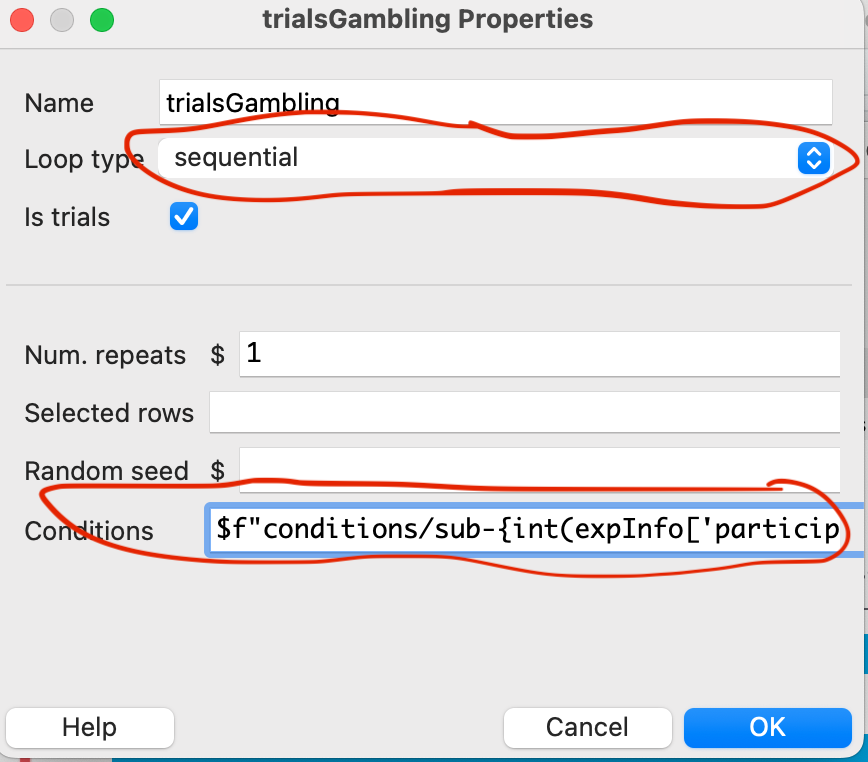

-   Switch the loop type to "sequential"

-   Instead of the file name in the "Conditions" field, add a variable that describes the name of the correct file depending on the subject id, session id and run number

-   For example, the following code describes a files located in the folder according the following structure: codnitions/sub-001/ses-01/sub-01_ses-01_task-gambling_run-01_conditions.csv (relative to psychopy project folder) and will load the corresponding files depending on the subject id and run number


``` python
$f"conditions/sub-{int(expInfo['participant']):03d}/ses-{int(expInfo['session']):02d}/sub-{int(expInfo['participant']):03d}_ses-{int(expInfo['session']):02d}_task-gambling_run-{int(expInfo['run']):02d}_conditions.xlsx"
```

``` python
f"conditions/sub-{int(expInfo['participant']):03d}/"
f"ses-{int(expInfo['session']):02d}/"
f"sub-{int(expInfo['participant']):03d}_"
f"ses-{int(expInfo['session']):02d}_"
f"task-gambling_run-{int(expInfo['run']):02d}_conditions.xlsx"
```


:::{.callout-important}
Mind the file separators! In the example above, we use "/" as a file separator, which works on Linux and MacOS. If you are using Windows, you should use "\" instead. However, in Python strings, the backslash is an escape character, so you need to use double backslashes "\\" to represent a single backslash in the file path.
:::

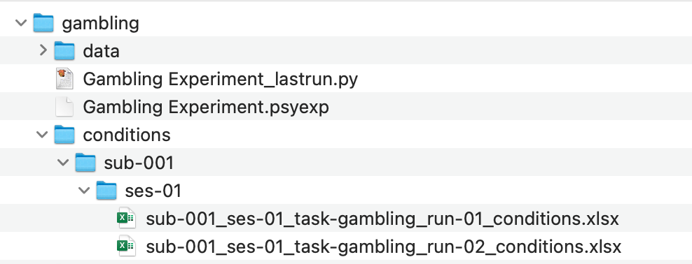

## BIDS plugin for PsychoPy

Should be installed and enabled to save events (conditions and button presses) in a comprehensive and standardized manner

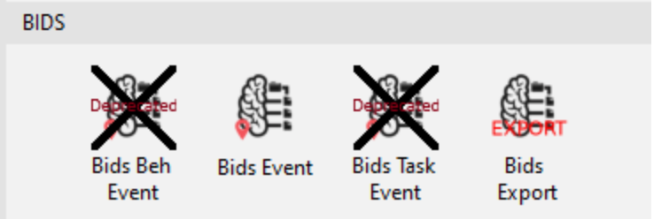

This will also make our data analysis easier

A warning on BIDS event:

-   do not rely on BIDS events exclusively; save as much information as possible on your experimental design

-   check the timing of your paradigm to make sure there are no unexpected delays

## References
