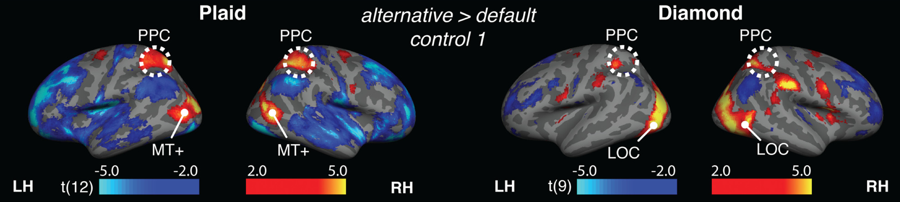
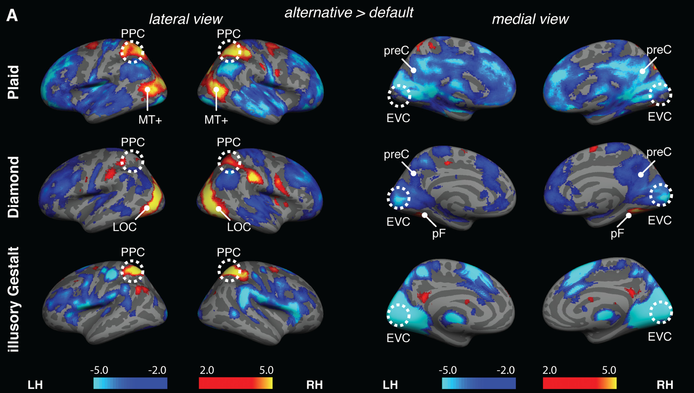
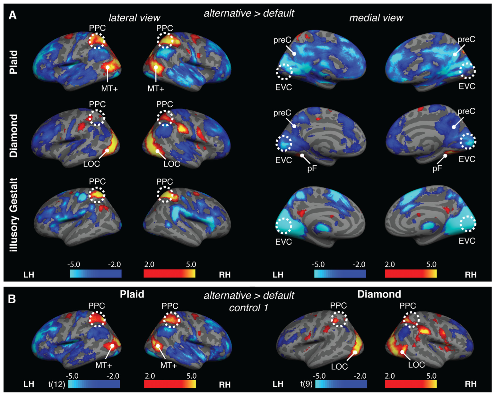
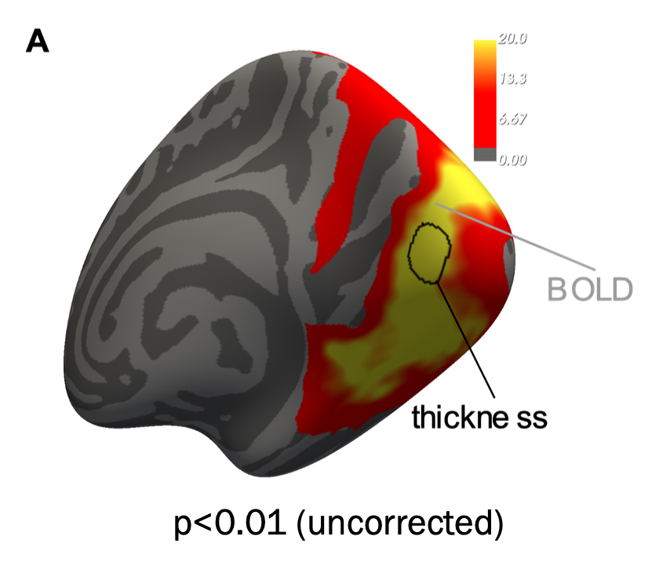
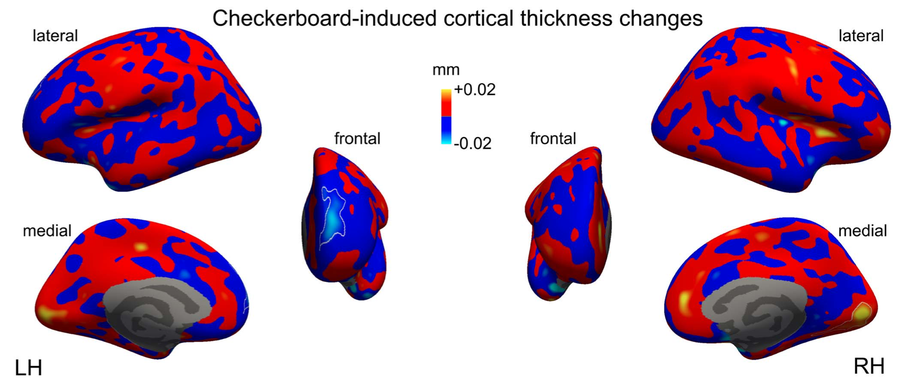

# Poster feedback

and desired adjustments for the written report

## Hemisphere labels

### Especially for the volume data, it should be clear which hemisphere is left and which is right, because these are inverted in the radiological convention

::: aside
[@grassi2018]
:::

## Contrast

### Is typically indicated in the title of the figure

::: aside
[@grassi2018]
:::

::: notes
It should be clear to the reader/viewer what they are looking at without looking for it for a long time
:::

## Color bar

### Should have a label indicating the meaning of the colors

::: aside
[@grassi2018]
:::

::: notes
Examples include: t-value, z-value, -log10(p)
:::

## Symmetric color scale

### So that there is no color bias toward activations/deactivations

### Usually it implies a two–tailed test

::: aside
[@grassi2018]
:::

## Identical color scales for similar plots

### Important for comparability

::: aside
[@grassi2018]
:::

## Statistical threshold and MCC

### Is typically indicated directly in the image

{width="512"}

::: aside
[@zaretskaya2022]
:::

::: notes
It is important to be transparent about the thresholds used
:::

## Too much activity

### Usually means that the contrast is not very specific

### In the worst case: threshold increase to emphasize the peaks

::: aside
[@zaretskaya2022]
:::

## References
