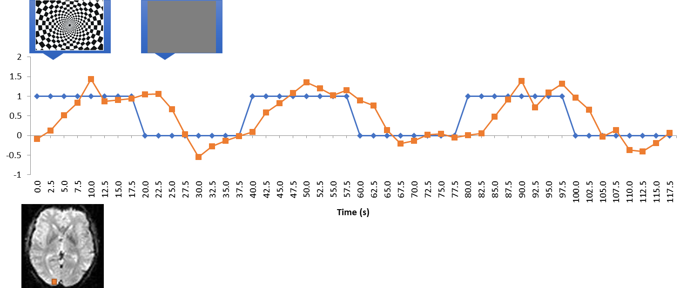
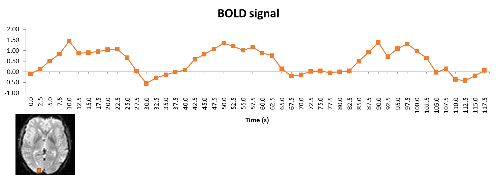
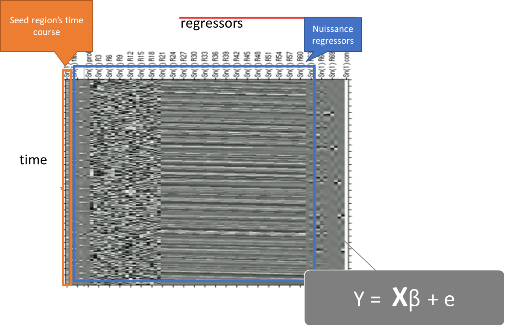
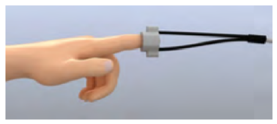
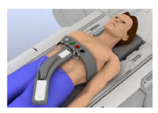
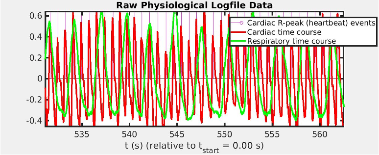
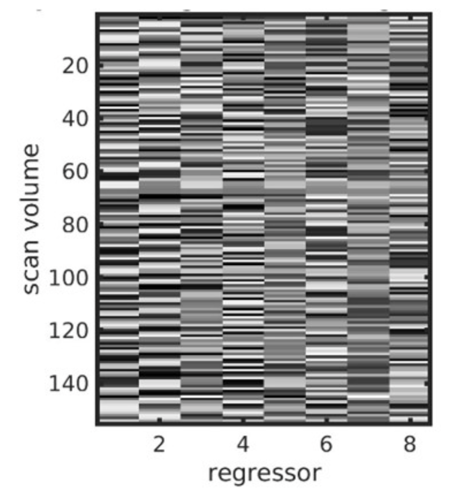
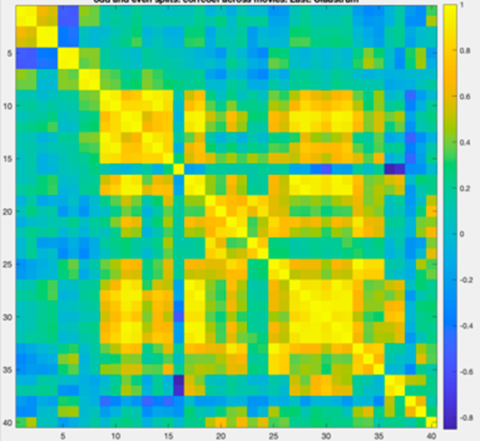
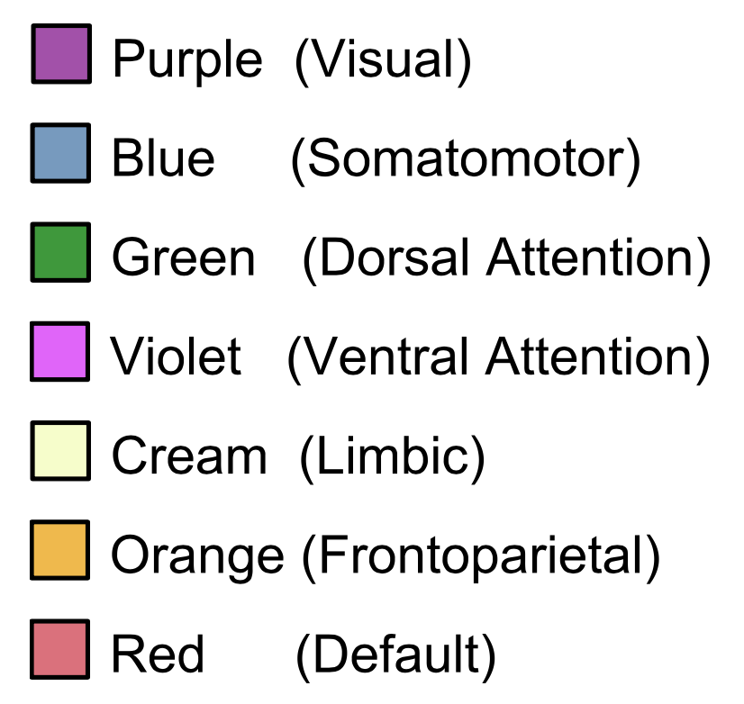
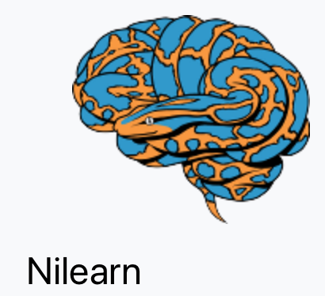

# Resting-state fMRI

## Default mode network (DMN)

![[@raichle2001]](images/clipboard-2878139788.png)

## Resting state activity

![[@fox2005a]](images/clipboard-2612449534.png)

## Reminder: the checkerboard experiment

## Resting state fluctuations

## Typical analysis

- Preprocessing

- Extensive denoising

- Functional "connectivity"

- Other measures

  - Network science characteristics

  - Functional connectivity density

## Preprocessing

Like in a typical fMRI experiment, see the corresponding chapter

## Denoising using a GLM

::: notes
Typical signals that get regressed out:

- Motion (relignment parameters)

- nth order derivatives of the realignment parameters

- Physiology regressors (respiration and heart beat)

  - Derivatives of white matter and CSF signals

  - Derivatives of pre-recorded pulse and respiration
:::

## Physiology recording

::: {layout-ncol="2"}
{width="450"}

{width="450"}
:::

## Raw data

## Regressors

{width="411"}

## Spine coil respiration sensor

![[@wilding2024]](images/clipboard-2429435046.png)

## Seed-to-voxel connectivity

![[@wilding2023]](images/clipboard-1640178898.png)

## ROI-to-ROI connectivity

## Parcellation schemes

![[@glasser2016]](images/clipboard-4155812755.png){width="677"}

## Independent component analysis

### Network parcellation

:::::: columns
::: {.column width="45%"}
![[@yeo2011]](images/clipboard-1114633871.png)
:::

::: {.column width="45%"}
![[@yeo2011]](images/clipboard-2058688517.png)
:::

::: {.column width="10%"}

:::
::::::

::: notes
Independent component analysis, procedure similar to factor analysis
:::

## Functional connectivity density mapping

![[@tomasi2010]](images/clipboard-1696910081.png){width="339"}

::: notes
lFCD: within a local viscinity of a voxel gFCD: global, i.e. across the whole brain
:::

## Graph theory

![[@sporns2010] (accessible through UniKat); see also: [@bassett2017]](images/clipboard-2585109022.png){width="599"}

::: notes
Thresholded correlation matrix

ROI pairs that correlate above a certain threshold are considered connected.

The difference between FCD and rich club coefficient is that the FSD is related to the number of connections, and rich club coefficient to a number of connections specifically to other highly connected areas.
:::

## Software

::: {layout-ncol="2"}

[{width="177"}](https://nilearn.github.io/dev/connectivity/index.html)
:::

## References
