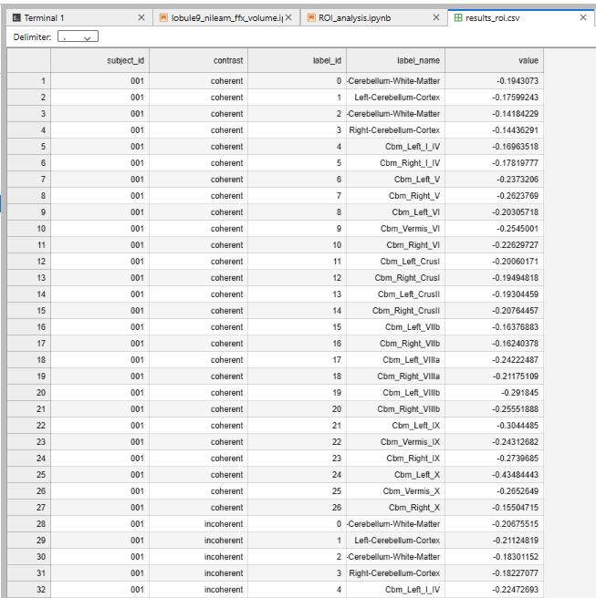
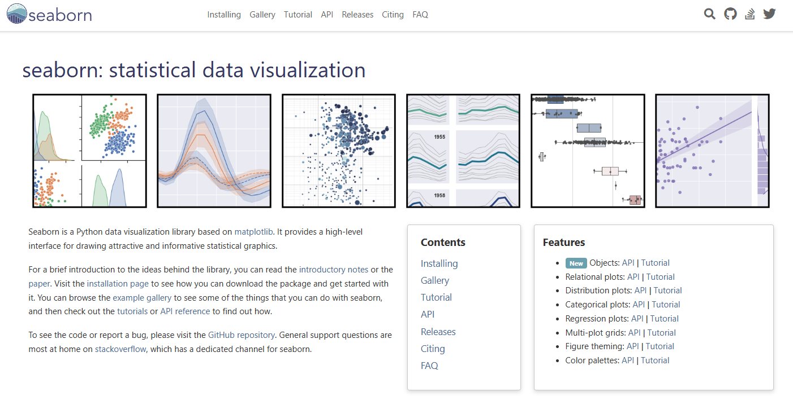
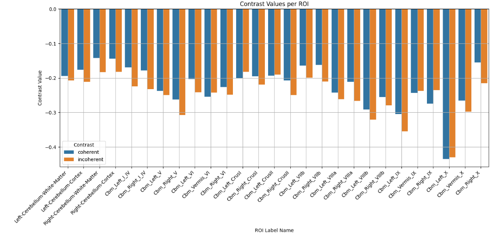

# ROI analysis

in nilearn

## Some guidelines

<https://visualneuroscience.github.io/dicom_to_glm/roi_analysis.html>

Note that the code provided there is rather complex and usually the number of ROIs, contrasts and conditions will be much smaller

## Generate contrast estimate maps from the GLM

``` python
# compute and write out contrast maps that will be used in the ROI analysis
# Note: we are using effect_size maps instead of z-stat

contrast_string_coh = "coh_audio"
# compute the contrast 
con_coh = models[0].compute_contrast(contrast_string_coh, output_type="effect_size")
con_coh.to_filename('contrasts/sub-001_contrast-coherent_statmap-effectsize.nii.gz')

contrast_string_inc = "inc_audio"
# compute the contrast 
con_inc = models[0].compute_contrast(contrast_string_inc, output_type="effect_size")
con_inc.to_filename('contrasts/sub-001_contrast-incoherent_statmap-effectsize.nii.gz')
```

## Subject loop

``` python
from nilearn.maskers import NiftiLabelsMasker
results_rois = []

for sub in subs:
    labels_file = f"/home/jovyan/2026_ANI/lobule9_bids_correct/derivatives/fastsurfer/sub-{sub}/mri/cerebellum.CerebNet.nii.gz"
    masker=NiftiLabelsMasker(labels_img=labels_file, labels=label_names, standardize=False)
    for contrast in contrast_names:
        print(f"Extracting contrast: {contrast} for subject: {sub}")
        label_values = masker.fit_transform(f"/home/jovyan/2026_ANI/glm/contrasts/sub-{sub}_contrast-{contrast}_statmap-effectsize.nii.gz")
        
        # Convert masker values to long format
        for label_idx, value in enumerate(label_values):  # Assuming masker_values is 2D with shape (1, n_labels)
            results_rois.append({
                "subject_id": sub,
                "contrast": contrast,
                "label_idx": label_idx,
                "label_name": label_names[label_idx],
                "value": value
            })
```

## Save as csv

``` python
import os
import pandas as pd
# Save results_main as a CSV file
output_dir = "/home/jovyan/2026_ANI/glm"
os.makedirs(output_dir, exist_ok=True)
df_main = pd.DataFrame(results_rois)
<!-- df_main.to_csv(f"{output_dir}/results_roi.csv", index=False) -->
print(f"Results saved to {output_dir}/results_roi.csv")
```



## Plot



## Result



## References {.smaller}
