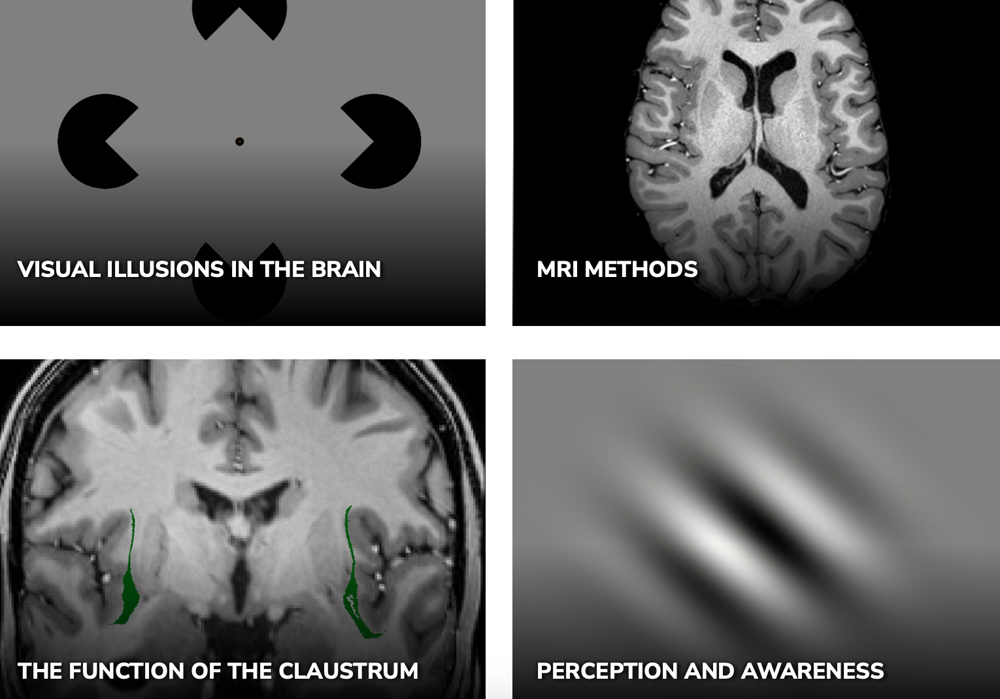
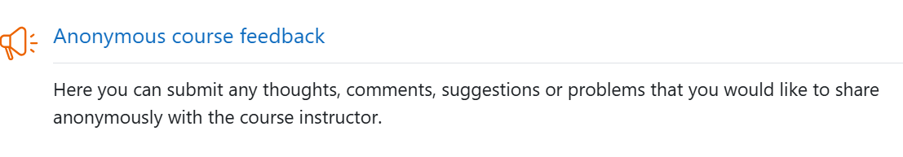
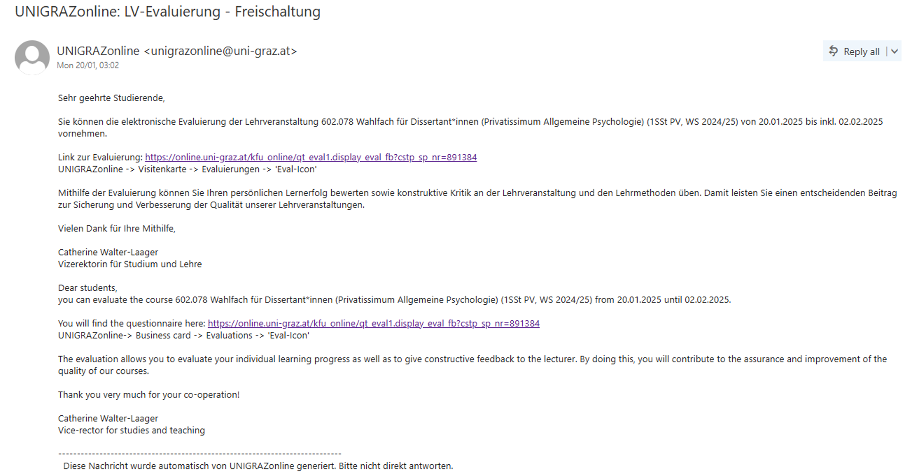

# Course Syllabus {.unnumbered}

602.942 Special seminar for doctoral students: How to design, conduct, analyze and write up fMRI experiments

{width="400"}

::: {style="font-size: 50%;"}
:::

## Lecturers

### Anja Ischebeck

["Cognitive Psychology and Neuroscience Lab"](https://cognitive-psychologie.uni-graz.at/en/)

### Natalia Zaretskaya

["Visual Neuroscience Lab"](https://neurovision.uni-graz.at/en/)

## Contact information

-   [anja.ischebeck\@uni-graz.at](mailto:anja.ischebeck@uni-graz.at)
-   [natalia.zaretskaya\@uni-graz.at](mailto:natalia.zaretskaya@uni-graz.at)
-   Office hours: Tuesdays 10:00-11:30, sign up via email
-   Talk to us informally after class

## Other courses (Natalia)

SS 2026

-   BSc SE "Neural Mechanisms of Consciousness"

-   MSc SE "Advanced Neuroimaging Methods"

-   PhD SE "How to plan, conduct, analyze and write up an fMRI study"

WS 2026

-   BSc VL "General Psychology I: Perception and Attention"

-   BSc KS "Selected Studies in General Psychology"

## Research interests (Natalia)

## Organisatory aspects

-   Let’s be “per du”

-   Course language is English or German, depending on the needs

-   Let's be less formal (please interrupt and ask questions!)

-   Course materials on Moodle: <https://moodle.uni-graz.at>

## Content of the course

-   Basics of performing an fMRI experiment
-   Modern practices in fMRI data analysis
-   Open science practices in Neuroimaging

The official course program can be adapted depending on the needs of individual participants

## Goals

-   Understand the possibilities and limitations of functional MRI

-   Be able to plan, conduct, analyze and interpret fMRI experiments in practice

-   Know and apply open science practices in the field of neuroimaging

## Possible workload for 3 ECTS

::: {style="font-size: 70%;"}
| **Activity** | **Hours per week** | **Total hours** | **Cumulative sum** |
|------------------|------------------|------------------|------------------|
| Classroom | 14 x 1.5 hours | 21 | 21 |
| Individual/group work | 14 x 3 | 42 | 63 |
| Report writing |  | 12 hours ⁓ 1.5 full work days! | 75 |
| **Total** |  | 75 |  |

: Example workload distribution according to 3 ECTS (75 hours) {#tbl-ects}
:::

## Course requirements

-   Active participation in class (not graded)

    -   Attendance (maximum 2 absences are tolerated)
    -   Contribution to class work/discussions
    -   Homework submissions (see the [Course Schedule Table](#tbl-schedule))

-   25%: Project concept presentation

-   25%: Result visualization presentation

-   50 %: Final report (individual)

    -   After the deadline the grade decreases by 1 point per 24 hours

-   Course feedback confirmation

    -   Submission of an [UGOnline](https://online.uni-graz.at) screenshot to [Moodle](https://moodle.uni-graz.at) before semester end

## Evaluation criteria {#sec-presentation-evaluation}

-   Project presentation

    -   Scientific merit
    -   Feasibility

-   Visualization presentation

    -   Clarity in conveying the message
    -   Scientific correctness

-   Report

    -   Formal correctness (see guidelines below)
    -   Understanding of all stages of course work

## Presentation guidelines {#sec-presentation-guidelines}

{width="300"}

-   Duration 15 minutes maximum

-   Aspects to address

    -   General relevance of the topic
    -   1-2 articles on the topic
    -   Specific research question
    -   Why is fMRI necessary?
    -   Specific experimental conditions...?

## Report guidelines

{width="300"}

-   Introduction: maximum 500 words

-   Methods: max 1000 words

    -   Participant
    -   Experimental paradigm
    -   Data acquisition
    -   Data analysis

-   Results: maximum 500 words

-   Discussion: maximum 500 words

-   References

## Course feedback

::::: columns
::: {.column width="50%"}
### During the course: via Moodle

:::

::: {.column width="50%"}
### At the end of the course

Submission of an [UGOnline](https://online.uni-graz.at) screenshot to [Moodle](https://moodle.uni-graz.at) before semester end

:::
:::::

## Course schedule



## Recommended reading

Will be announced as we go along

## AI usage in general

![[@kosmyna2025]](images/clipboard-3349732845.png)

::: notes
ChatGPT, CoPilot & similar tools are **not prohibited** in this course. These technologies may be helpful for structuring a poster, generating ideas, or revising texts. However, when using AI tools, always adhere to the **principles of good academic practice**. You, as a student, remain fully responsible for the accuracy and correctness of all submitted content generated with such tools. Verbatim use of AI-generated text passages must be clearly marked – just like traditional quotations – by citing the AI system used and specifying the nature of the interaction (see "[Orientation Guidelines for the Use of Text-Generating AI Systems at the University of Graz](https://static.uni-graz.at/fileadmin/_files/_project_sites/_lehren-und-lernen-mit-ki/AI_Orientation_Guidelines_230901.pdf)", pp. 1–2).

Submissions that are primarily or entirely generated by AI systems are not permitted. When using generative AI, you must ensure that your prompts and inputs do not violate any third-party rights, including copyright, personality rights, or data protection regulations. In this course, I advocate for a critical and reflective approach to AI technologies. Understanding their limitations is just as important as exploring their potential. Key weaknesses of AI tools include:

\- *Bias (e.g., sexism, racism, etc.)*

\- *Lack of scientific accuracy*

\- *Hallucinations (fabricated content)*

\- *And most importantly: letting AI generate your work can hinder your own thinking, reflection, the development of your own perspective, and a critical academic mindset.\
*

Further information is available on the [Teaching & Learning with AI website of the University of Graz](https://lehren-und-lernen-mit-ki.uni-graz.at/en/for-students/).
:::

## AI usage (official) {#sec-ai-uni}

*The use of generative AI is generally possible in this course. Please note, however, that you as a student bear full responsibility for the accuracy of the generated content.*

*An academic integrity statement is required for each submitted paper, the verbatim copying of AI-generated text passages must be marked - analogous to conventional citations - by stating the AI system and the specification of the interaction (see “[Orientation guidelines for dealing with text-generating AI systems at the University of Graz](https://static.uni-graz.at/fileadmin/_files/_project_sites/_digitalelehre/Orientierungsrahmen/KI-Orientierungsrahmen_230901.pdf)”, p. 1-2).*

*It is only prohibited to submit work that was created predominantly or even exclusively using generative AI.*

*When using generative AI, please ensure that your submissions do not violate the rights of third parties, including copyright, personal rights, and data protection regulations.*

## AI usage (this course) {#sec-ai-course}

AI usage is conditional on full disclosure:

-   250 words maximum attachment to the report with a description of which AI tools were used and how exactly were they applied

-   You bare responsibility for the correctness and authorship of the written text

-   I keep the right to invite you and ask questions about the content

::: {.content-visible when-format="revealjs"}
## Time for questions

{width="300"}

You can also ask questions in [Moodle](https://moodle.uni-graz.at/) forum
:::

## References
