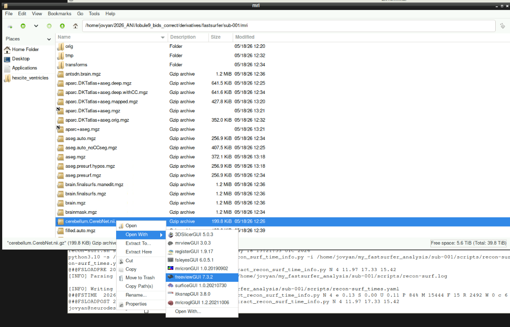
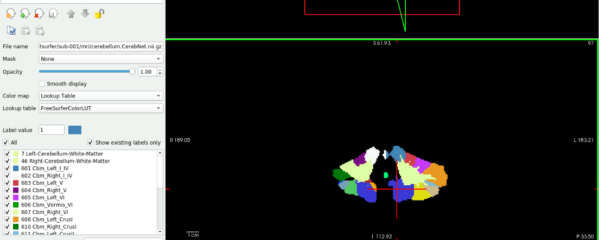
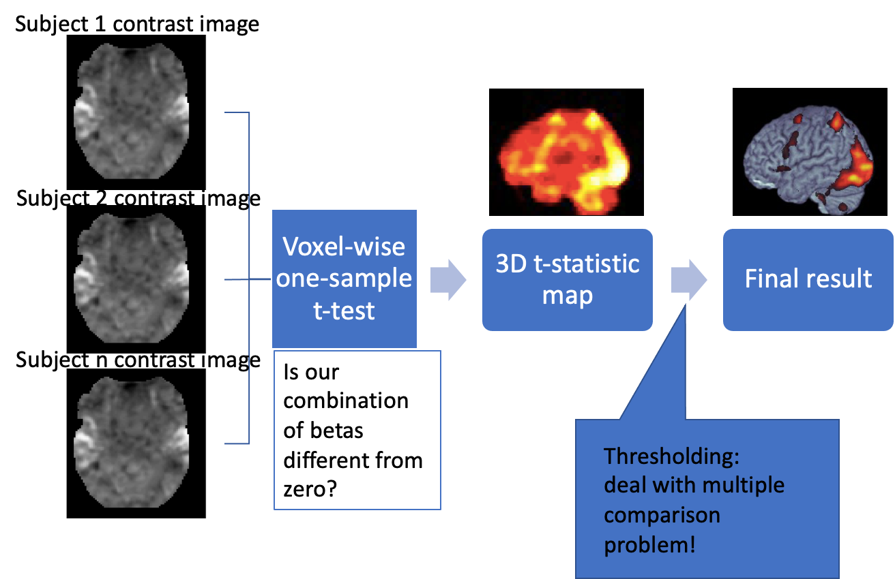
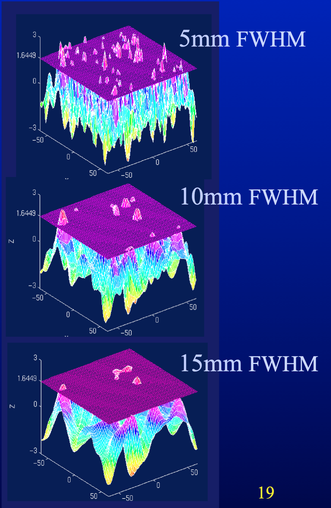
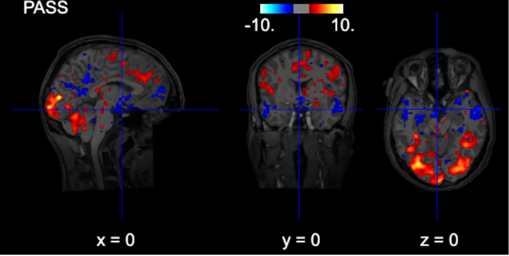
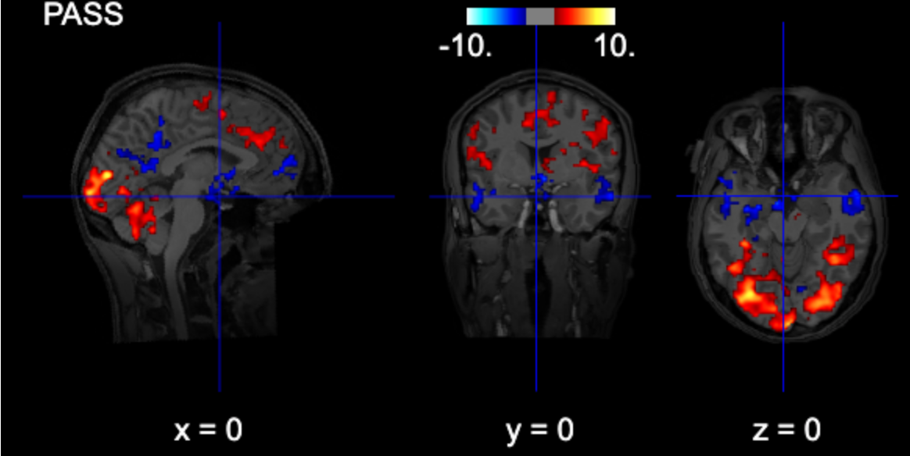
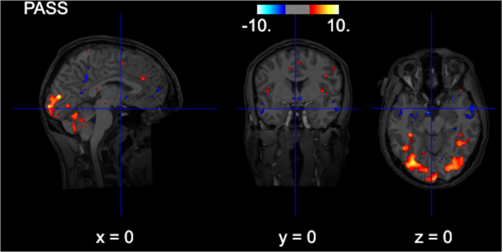
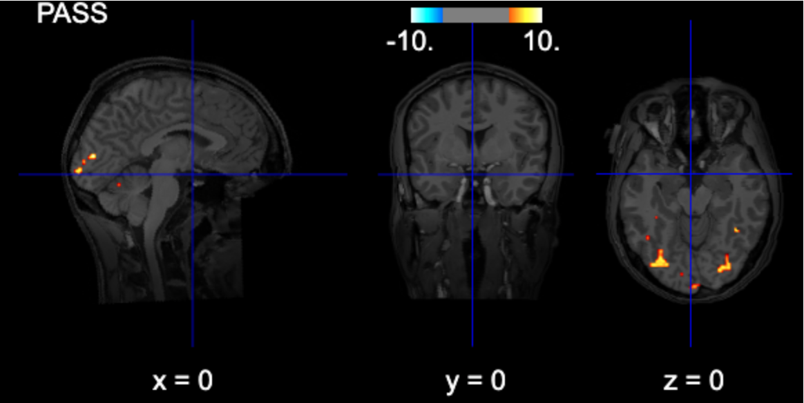
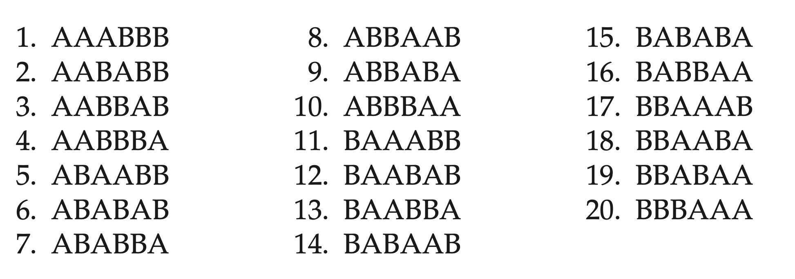
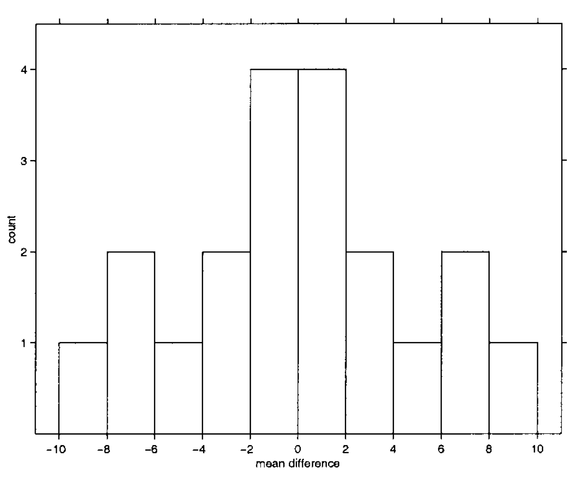

# ROI analysis

See also: [Planning](planning.qmd) 

::: notes
If you were planning a ROI analysis, you will typically have one value per ROI, subject and condition. You can report descriptive statistics graphically using your favourite approach (violin plots, bar plots, boxplots, etc.).

Usually we also visualize ROIs at their locations.
:::

## Example

::::: columns
::: {.column width="50%"}
![[@faber2022]](images/clipboard-13566197.png)
:::

::: {.column width="50%"}
![[@faber2022]](images/clipboard-1367835494.png)
:::
:::::

## Run the segmentation

[Deep-MI/FastSurfer: PyTorch implementation of FastSurferCNN](https://github.com/Deep-MI/FastSurfer/tree/dev)

![[@henschel2020]](images/clipboard-1015670060.png)

``` bash
# create the directory
mkdir /home/jovyan/2026_ANI/lobule9_bids_correct/derivatives/fastsurfer

# run the fastsurfer as a singularity container
singularity exec --nv \
                 --no-mount home,cwd -e \
                 -B $HOME/2026_ANI/lobule9_bids_correct:$HOME/my_mri_data \
                 -B $HOME/2026_ANI/lobule9_bids_correct/derivatives/fastsurfer:$HOME/my_fastsurfer_analysis \
                 -B $HOME/license.txt:$HOME/my_fs_license.txt \
                 /shared/singularity/fastsurfer-gpu.sif \
                   /fastsurfer/run_fastsurfer.sh \
                     --fs_license $HOME/my_fs_license.txt \
                     --t1 $HOME/my_mri_data/sub-001/ses-1/anat/sub-001_ses-1_acq-mprage_T1w.nii.gz \
                     --sid sub-001 --sd $HOME/my_fastsurfer_analysis \
                     --3T \
                     --threads 4 \
                     --seg_only
```

## View output

::::: columns
::: {.column width="50%"}

:::

::: {.column width="50%"}

:::
:::::

# Multiple comparison correction

## Reminder: group analysis



## Family-wise error rate

{width="391"}

::: notes
If the data is not smoothed, equivalent to Bonferroni correction
:::

## Other correction types

### - Cluster threshold

### - False discovery rate

### - Cluster-level inference

## Uncorrected



::: notes
``` python
# interactive plot (you can browse the activations)
from nilearn import plotting

# Use subject's anatomy as background
bg_img = '/home/jovyan/gambling/bids/derivatives/fmriprep/sub-001/ses-1/anat/sub-001_ses-1_acq-mprage_desc-preproc_T1w.nii.gz'
plotting.view_img(zmap, threshold=1.96, vmax=10, 
    bg_img=bg_img,
    cut_coords=[0, 0, 0],
    width_view=600,
    title=contrast_string)
```
:::

## Cluster-thresholded



::: notes
``` python
from nilearn.glm import threshold_stats_img

# note: fpr with alpha=0.05 is the same as uncorrected z>=1.96 (p<0.05)
thresholded_map1, threshold1 = threshold_stats_img(
    zmap,
    alpha=0.05,
    height_control="fpr",
    cluster_threshold = 100,
    two_sided=True,
)

# Use subject's anatomy as background
bg_img = '/home/jovyan/gambling/bids/derivatives/fmriprep/sub-001/ses-1/anat/sub-001_ses-1_acq-mprage_desc-preproc_T1w.nii.gz'
plotting.view_img(thresholded_map1, threshold=threshold1, vmax=10, 
    bg_img=bg_img,
    cut_coords=[0, 0, 0],
    width_view=600,
    title=contrast_string)
```
:::

## FDR-thresholded



::: notes
``` python
from nilearn.glm import threshold_stats_img

thresholded_map1, threshold1 = threshold_stats_img(
    zmap,
    alpha=0.05,
    height_control="fdr",
    two_sided=True,
)

# Use subject's anatomy as background
bg_img = '/home/jovyan/gambling/bids/derivatives/fmriprep/sub-001/ses-1/anat/sub-001_ses-1_acq-mprage_desc-preproc_T1w.nii.gz'
plotting.view_img(thresholded_map1, threshold=threshold1, vmax=10, 
    bg_img=bg_img,
    cut_coords=[0, 0, 0],
    width_view=600,
    title=contrast_string)
```
:::

## FWE-thresholded



::: notes
``` python
from nilearn.glm import threshold_stats_img

thresholded_map1, threshold1 = threshold_stats_img(
    zmap,
    alpha=0.05,
    height_control="bonferroni",
    two_sided=True,
)

# Use subject's anatomy as background
bg_img = '/home/jovyan/gambling/bids/derivatives/fmriprep/sub-001/ses-1/anat/sub-001_ses-1_acq-mprage_desc-preproc_T1w.nii.gz'
plotting.view_img(thresholded_map1, threshold=threshold1, vmax=10, 
    bg_img=bg_img,
    cut_coords=[0, 0, 0],
    width_view=600,
    title=contrast_string)
```
:::

## Non-parametric inference

### Permutation-based inference

::::: columns
::: {.column width="50%"}

:::

::: {.column width="50%"}

:::
:::::

::: aside
[@nichols2001]
:::

::: notes
An example difference between conditions A and B. The labels of each trial are permuted and each time a test statistic (in this example mean difference) is computed. The empirical likelihood to observe a specific value is derived.

For the multiple comparison case, we use the same logic, but instead of single voxel we consider the maximum of each statistical map.
:::

# Result reporting

## Whole-brain analysis

-   P-value threshold, MC correction method

-   All clusters with

    -   size

    -   peak statistic value

    -   MNI coordinates

    -   anatomical area (see [atlasreader](https://github.com/miykael/atlasreader) and the associated notebook)

## Region-of-interest analysis

-   MCC for the number of areas examined

## References
