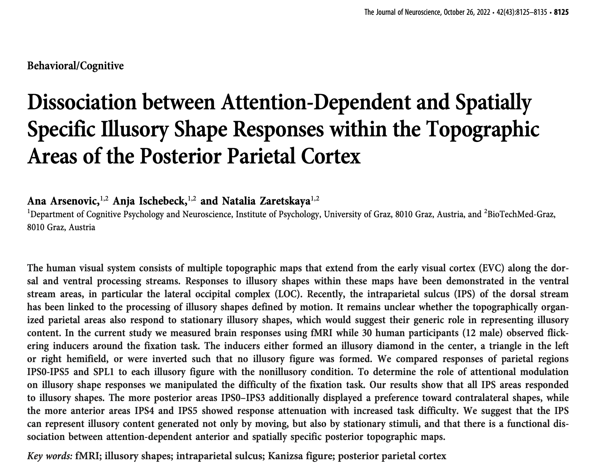

# fMRI article

## Exercise

::: aside
[@arsenovic2022]
:::

## Groups

1.  Methods: Participants - Preprocessing
2.  Methods: Data analysis (excluding control analysis)
3.  Results

TODO:

-   Read the corresponding sections

-   Note things that were unclear, surprising, raised questions

## References
